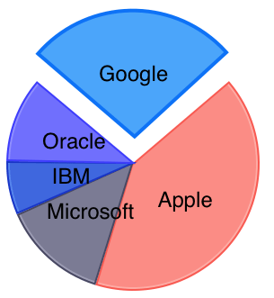

# Chart: Selection

This help topic demonstrates how you can make your charts more interactive by enabling a selection behavior.

## Configure ##

You can alter the selection mode by altering the chart <code>seriesSelectionMode</code> and <code>dataPointSelectionMode</code> properties with the following value:

- TKChartSelectionModeNone - No selection.
- TKChartSelectionModeSingle - A single point/series can be selected.
- TKChartSelectionModeMultiple - Multiple points/series can be selected.

In addition you can finely tune the selection by setting the <code>selection</code> property of each series:

- TKChartSeriesSelectionNotSet - Selection not set for this series, fall back to the chart selection settings.
- TKChartSeriesSelectionNone - Selection disabled.
- TKChartSeriesSelectionSeries - Whole series selection.
- TKChartSeriesSelectionDataPoint - Single data point selection.
- TKChartSeriesSelectionDataPointMultiple - Select multiple data points.

This way each series can have a separate selection mode. One series can select a single point, another series can select multiple points and a third series can
be selected as a whole series if necessary. Please note that the series selection has higher priority than the chart selection.

Use the <code>selectedSeries</code> and <code>selectedPoints</code> properties to get currently selected series or points respectively.

<snippet id='chart-get-selected-series'/>
<snippet id='chart-get-selected-series-swift'/>
```C#
foreach (TKChartSeries series in chart.SelectedSeries) {
    Console.WriteLine ("selected series at index {0}", series.Index);
}

foreach (TKChartSelectionInfo info in chart.SelectedPoints) {
    Console.WriteLine ("selected point at index {0} from series {1}", info.DataPointIndex, info.Series.Index);
}
```

The <code>isSelected</code> property of TKChartSeries indicates whether the series is selected.

You can determine whether a selection is changed by adopting <code>TKChartDelegate</code> protocol and implementing one the following methods:

<snippet id='chart-selection-delegate'/>
<snippet id='chart-selection-delegate-swift'/>
```C#
class ChartDelegate: TKChartDelegate
{
    public override void SeriesSelected (TKChart chart, TKChartSeries series)
    {
        // Here you can perform the desired action when the selection is changed.
    }

    public override void PointSelected (TKChart chart, TKChartData point, TKChartSeries series, nint index)
    {
        // Here you can perform the desired action when the selection is changed.
    }

    public override void SeriesDeselected (TKChart chart, TKChartSeries series)
    {
        // Here you can perform the desired action when the selection is changed.
    }

    public override void PointDeselected (TKChart chart, TKChartData point, TKChartSeries series, nint index)
    {
        // Here you can perform the desired action when the selection is changed.
    }
}
```

In addition, you can change the selection programmatically by calling the <code>select</code> method in the following manner:

<snippet id='chart-progrm-selection'/>
<snippet id='chart-progrm-selection-swift'/>
```C#
public override void ViewDidAppear (bool animated)
{
    base.ViewDidAppear (animated);
    chart.Select (new TKChartSelectionInfo (chart.Series [0], 0));
}
```



Note that you can clear the selection by passing *nil* value to the <code>series</code> argument.


