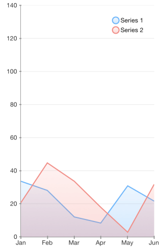
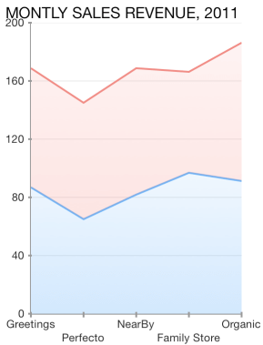
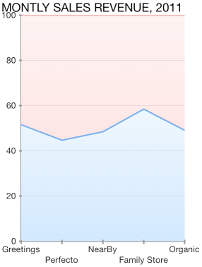

## Chart for Xamarin.iOS: Area Series

As a derivative of <code>TKChartLineSeries</code> series, <code>TKChartAreaSeries</code> plots its data points in line. Once positioned on the plot area the points are connected to form a line. Further, the area enclosed between this line and the axis is filled. 

Below is a sample snippet that demonstrates how to set up two Area series:

```C#
var pointsWithCategoriesAndValues = new List<TKChartDataPoint> ();
var pointsWithCategoriesAndValues2 = new List<TKChartDataPoint> ();

var categories = new [] { "Greetings", "Perfecto", "NearBy", "Family Store", "Fresh & Green" };
var values = new [] { 70, 75, 58, 59, 88 };

for (int i = 0; i < categories.Length; ++i) {
    pointsWithCategoriesAndValues.Add (new TKChartDataPoint (new NSString (categories [i]), new NSNumber (values [i])));
}

var values2 = new [] { 40, 80, 32, 69, 95 };
for (int i = 0; i < categories.Length; ++i) {
    pointsWithCategoriesAndValues2.Add (new TKChartDataPoint (new NSString (categories [i]), new NSNumber (values2 [i])));
}

chart.AddSeries (new TKChartAreaSeries (pointsWithCategoriesAndValues.ToArray ()));
chart.AddSeries (new TKChartAreaSeries (pointsWithCategoriesAndValues2.ToArray ()));
```



## Configure stacking of area series

The <code>TKChartAreaSeries</code> can be combined by using different stack modes.

The Stack plots the points on top of each other:

```C#
var stackInfo = new TKChartStackInfo (new NSNumber (1), TKChartStackMode.Stack);

var seriesForIncome = new TKChartAreaSeries (pointsWithCategoriesAndValues.ToArray ());
seriesForIncome.StackInfo = stackInfo;

var seriesForExpenses = new TKChartAreaSeries (pointsWithCategoriesAndValues2.ToArray ());
seriesForExpenses.StackInfo = stackInfo;

chart.BeginUpdates ();
chart.AddSeries (seriesForIncome);
chart.AddSeries (seriesForExpenses);
chart.EndUpdates ();
```



The Stack100 displays the value as percent:



## Configure visual appearance of area series

If you want to change the series' fill and stroke, you should modify the corresponding properties of the <code>TKChartPaletteItem</code>:

```C#
series.Style.Palette = new TKChartPalette ();
TKChartPaletteItem palleteItem = new TKChartPaletteItem ();
palleteItem.Stroke = new TKStroke(strokes[i], 1.5f);
palleteItem.Fill = new TKLinearGradientFill (fills[i], new CGPoint(0, 0), new CGPoint(1, 1));
series.Style.Palette.AddPaletteItem(palleteItem);
```

