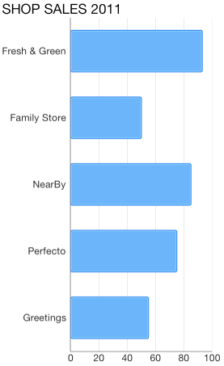
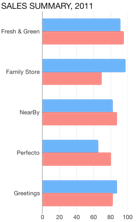
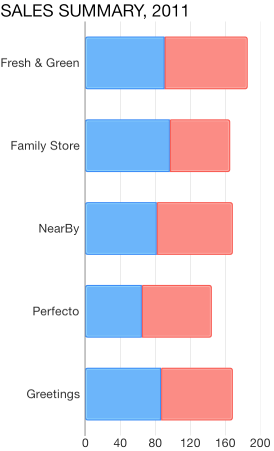
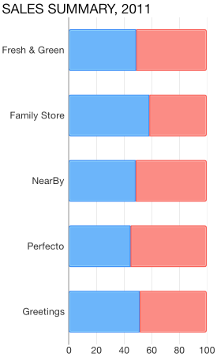
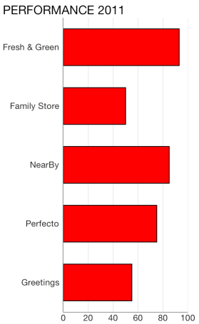
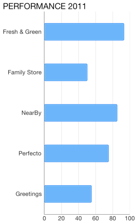

## Chart for Xamarin.iOS: Bar Series

<code>TKChartBarSeries</code> are used to visualize data points as bar blocks where the width of each bar denotes the magnitude of its value. The following snippet demonstrates how to manually populate one Bar series:

```C#
Random r = new Random ();
List<TKChartDataPoint> list = new List<TKChartDataPoint> ();
for (int i = 0; i < 8; i++) {
    list.Add (new TKChartDataPoint (new NSNumber (r.Next () % 100), new NSNumber (i + 1)));
}

TKChartBarSeries series = new TKChartBarSeries (list.ToArray());
series.Style.PaletteMode = TKChartSeriesStylePaletteMode.UseItemIndex;
series.Selection = TKChartSeriesSelection.DataPoint;
chart.AddSeries (series);
```



## Configure clustering of bar series

If you want to cluster multiple bar series side by side, they should use a shared y-axis:

```C#
var pointsWithCategoriesAndValues = new List<TKChartDataPoint> ();
var pointsWithCategoriesAndValues2 = new List<TKChartDataPoint>();
var categories = new [] { "Greetings", "Perfecto", "NearBy", "Family Store", "Fresh & Green" };
var values = new [] { 70, 75, 58, 59, 88 };

for (int i = 0; i < categories.Length; ++i) {
    pointsWithCategoriesAndValues.Add (new TKChartDataPoint (new NSNumber (values [i]), NSObject.FromObject (categories [i])));
}

var values2 = new [] { 40, 80, 32, 69, 95 };
for (int i = 0; i < categories.Length; ++i) {
    pointsWithCategoriesAndValues2.Add (new TKChartDataPoint (new NSNumber(values2 [i]), NSObject.FromObject(categories [i])));
}

List<NSObject> objectCategories = new List<NSObject> ();
for (int i = 0; i < categories.Length; i++) {
    objectCategories.Add (new NSString (categories [i]));
}
var categoryAxis = new TKChartCategoryAxis (objectCategories.ToArray());
chart.YAxis = categoryAxis;

var series1 = new TKChartBarSeries(pointsWithCategoriesAndValues.ToArray());
series1.YAxis = categoryAxis;

var series2 = new TKChartBarSeries(pointsWithCategoriesAndValues2.ToArray());
series2.YAxis = categoryAxis;

chart.BeginUpdates();
chart.AddSeries(series1);
chart.AddSeries(series2);
chart.EndUpdates();
```



## Configure stacking of bar series

The <code>TKChartBarSeries</code> can be combined by using different stack modes, available options for <code>TKChartStackMode</code> are *Stack* and *Stack100*.

The Stack plots the points on top of each other:

```C#
var stackInfo = new TKChartStackInfo(new NSNumber(1), TKChartStackMode.Stack);

var series1 = new TKChartBarSeries(pointsWithCategoriesAndValues.ToArray());
series1.StackInfo = stackInfo;

var series2 = new TKChartBarSeries(pointsWithCategoriesAndValues2.ToArray());
series2.StackInfo = stackInfo;

chart.BeginUpdates();
chart.AddSeries(series1);
chart.AddSeries(series2);
chart.EndUpdates();
```



The Stack100 displays the value as percent:

```C#
var stackInfo = new TKChartStackInfo(new NSNumber(1), TKChartStackMode.Stack100);

var series1 = new TKChartBarSeries(pointsWithCategoriesAndValues.ToArray());
series1.StackInfo = stackInfo;

var series2 = new TKChartBarSeries(pointsWithCategoriesAndValues2.ToArray());
series2.StackInfo = stackInfo;

chart.BeginUpdates();
chart.AddSeries(series1);
chart.AddSeries(series2);
chart.EndUpdates();
```



## Configure visual appearance of bar series

If you would like to customize the appearance of bar series, you should change its <code>Style</code> properties. You can change the fill and stroke in the following manner:

```C#
var series = new TKChartBarSeries (pointsWithCategoriesAndValues.ToArray());
series.Style.Palette = new TKChartPalette ();

var paletteItem = new TKChartPaletteItem ();
paletteItem.Fill = new TKSolidFill (UIColor.Red);
paletteItem.Stroke = new TKStroke (UIColor.Black);
series.Style.Palette.AddPaletteItem (paletteItem);
chart.AddSeries (series);
```



You can change the gap between columns with the following code snippet:

```C#
var series = new TKChartBarSeries (pointsWithCategoriesAndValues.ToArray ());
series.GapLength = 0.5f;
chart.AddSeries (series);
```

Note that the value should be between 0 and 1, where a value of 0 means that a bar would take the entire space between two ticks, while a value of 1 means the bar will have zero width as all the space should appear as a gap.



It is also possible to limit the height of the bar using <code>MaxBarHeight</code> and <code>MinBarHeight</code> properties.

```C#
var series = new TKChartBarSeries (pointsWithCategoriesAndValues.ToArray ());
series.MinBarHeight = 20;
series.MaxBarHeight = 50;
chart.AddSeries (series);
```
