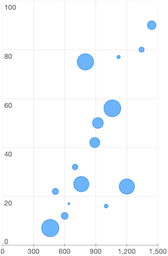

# Chart Series: Bubble


<code>TKChartBubbleSeries</code> derives from <code>TKChartScatterSeries</code> and it represents a bubble chart. Bubble series visualizes <code>TKChartBubbleDataPoint</code> which has three parameters - <code>dataXValue</code>, <code>dataYValue</code> and <code>area</code>. The <code>scale</code> and <code>biggestBubbleDiameterForAutoscale</code> properties determine the diameter of a bubble on the chart.

Here is an example of a bubble chart:

<snippet id='chart-bubble'/>
<snippet id='chart-bubble-swift'/>
```C#
Random r = new Random ();
for (int i = 0; i < 2; i++) {
    List<TKChartBubbleDataPoint> list = new List<TKChartBubbleDataPoint> ();
    for (int j = 0; j < 20; j++) {
        list.Add (new TKChartBubbleDataPoint (new NSNumber (r.Next () % 1450), new NSNumber (r.Next () % 150), new NSNumber (r.Next () % 200)));
    }

    TKChartBubbleSeries series = new TKChartBubbleSeries (list.ToArray());
```


