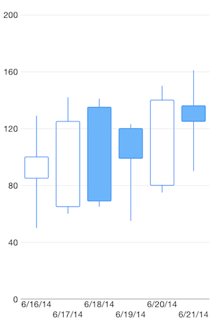
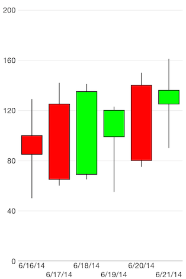

# Chart Series: Candlestick

**TKChart** supports **Candlestick** stock series. This series operates with a special kind of data in the form of four parameters defining the stock market - open, high, low, and close. The high and low values show the price range (the highest and lowest prices) over one unit of time. The open and close values indicate the opening and closing price of the stock for the corresponding period. Candlestick series have body, which has a different color depending on the value of open and close prices of the financial data point. The width of the candlestick body is determined by the period between 2 candlesticks and the range of the axis. You should use the <code>minorTickIntervalUnit</code> property of <code>TKChartDateTimeAxis</code> to change the period between 2 candlesticks. Here is how to set up Candlestick series:

<snippet id='chart-candlestick'/>
<snippet id='chart-candlestick-swift'/>
```C#
var openPrices = new [] { 100, 125, 69, 99, 140, 125 };
var closePrices = new [] { 85, 65, 135, 120, 80, 136 };
var lowPrices = new [] { 50, 60, 65, 55, 75, 90 };
var highPrices = new [] { 129, 142, 141, 123, 150, 161 };
var dateNow = NSDate.Now;
var financialDataPoints = new List<TKChartFinancialDataPoint> ();

for (int i = 0; i < openPrices.Length; ++i) {
    var date = dateNow.AddSeconds ((double)(60 * 60 * 24 * i));
    financialDataPoints.Add (new TKChartFinancialDataPoint (date, new NSNumber(openPrices [i]), new NSNumber(highPrices [i]), 
        new NSNumber(lowPrices [i]), new NSNumber(closePrices [i]), null));
}

var candlestickSeries = new TKChartCandlestickSeries (financialDataPoints.ToArray ());
chart.AddSeries (candlestickSeries);

var xAxis = chart.XAxis as TKChartDateTimeAxis;
xAxis.MinorTickIntervalUnit = TKChartDateTimeAxisIntervalUnit.Days;
xAxis.PlotMode = TKChartAxisPlotMode.BetweenTicks;
xAxis.MajorTickInterval = 1.0;
```



## Configure visual appearance of candlestick series

If you want to customize the appearance of cthe andlestick series, you should implement the**TKChartDelegate** protocol as shown below:

<snippet id='chart-candlestick-visual'/>
<snippet id='chart-candlestick-visual-swift'/>
```C#
public override TKChartPaletteItem PaletteItemForSeries (TKChart chart, TKChartSeries series, nint index)
{
    var dataPoint = series.DataPointAtIndex ((uint)index);
    var stroke = new TKStroke (UIColor.Black);
    var fill = new TKSolidFill ();
    if (dataPoint.Close.DoubleValue < dataPoint.Open.DoubleValue) {
        fill.Color = UIColor.Red;
    } else {
        fill.Color = UIColor.Green;
    }
    var paletteItem = new TKChartPaletteItem (stroke, fill);
    return paletteItem;
}
```


