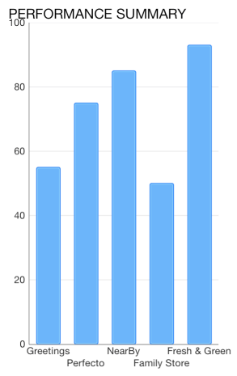
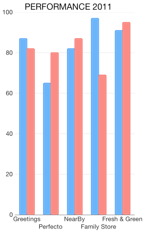
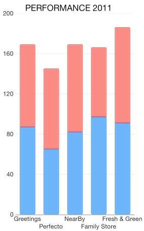
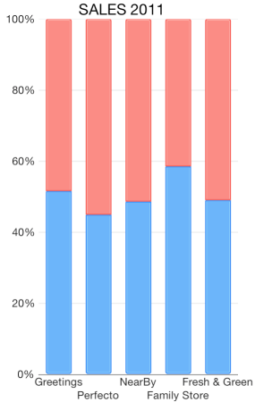
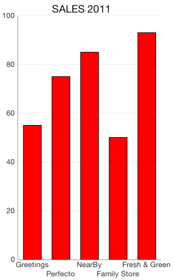
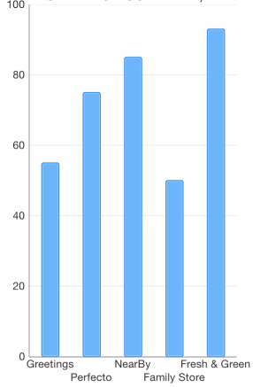

# Chart Series: Column

<code>TKChartColumnSeries</code> are used to visualize data points as column blocks where the height of each bar denotes the magnitude of its value. The following snippet demonstrates how to manually populate one Column series:

<snippet id='chart-column'/>
<snippet id='chart-column-swift'/>
```C#
Random r = new Random ();
List<TKChartDataPoint> list = new List<TKChartDataPoint> ();
for (int i = 0; i < 8; i++) {
    list.Add(new TKChartDataPoint (new NSNumber (i+1), new NSNumber (r.Next () % 100)));
}

TKChartColumnSeries series = new TKChartColumnSeries (list.ToArray());
series.Style.PaletteMode = TKChartSeriesStylePaletteMode.UseItemIndex;
series.Selection = TKChartSeriesSelection.DataPoint;

series.MaxColumnWidth = 50;
series.MinColumnWidth = 20;

chart.AddSeries(series);
```



## Configure clustering of column series

If you want to cluster multiple column series side by side, they should use a shared x-axis:

<snippet id='chart-column-cls'/>
<snippet id='chart-column-cls-swift'/>
```C#
Random r = new Random();
for (int i = 0; i < 4; i++) {
    List<TKChartDataPoint> list = new List<TKChartDataPoint>();
    for (int j = 0; j < 8; j++) {
        list.Add(new TKChartDataPoint(new NSNumber(j), new NSNumber(r.Next() % 100)));
    }

    TKChartColumnSeries series = new TKChartColumnSeries (list.ToArray ());
    series.Title = String.Format ("Series %d", i);
    series.StackInfo = stackInfo;
    series.Selection = TKChartSeriesSelection.Series;
    chart.AddSeries (series);
}
```



## Configure stacking of column series

The <code>TKChartColumnSeries</code> can be combined by using different stack modes.

The Stack plots the points on top of each other.

<snippet id='chart-stack-area'/>
<snippet id='chart-stack-area-swift'/>
```C#
var stackInfo = new TKChartStackInfo (new NSNumber (1), TKChartStackMode.Stack);

var seriesForIncome = new TKChartAreaSeries (pointsWithCategoriesAndValues.ToArray ());
seriesForIncome.StackInfo = stackInfo;

var seriesForExpenses = new TKChartAreaSeries (pointsWithCategoriesAndValues2.ToArray ());
seriesForExpenses.StackInfo = stackInfo;

chart.BeginUpdates ();
chart.AddSeries (seriesForIncome);
chart.AddSeries (seriesForExpenses);
chart.EndUpdates ();
```



The Stack100 displays the value as percent.

<snippet id='chart-stack-area-100'/>
<snippet id='chart-stack-area-100-swift'/>
<snippet id='chart-stack-area-100-cs'/>



## Configure visual appearance of column series

If you want to customize the appearance of a column series, you should change its <code>style</code> properties.

You can change the fill and stroke in the following manner:

<snippet id='chart-column-visual'/>
<snippet id='chart-column-visual-swift'/>
```C#
series.Style.Palette = new TKChartPalette ();

var paletteItem = new TKChartPaletteItem ();
paletteItem.Fill = new TKSolidFill (UIColor.Red);
paletteItem.Stroke = new TKStroke (UIColor.Black);
series.Style.Palette.AddPaletteItem (paletteItem);
chart.AddSeries (series);
```



You can change the gap between columns with the <code>gapLength</code> property/

<snippet id='chart-gap'/>
<snippet id='chart-gap-swift'/>
```C#
series.GapLength = 0.6f;
```

Note that the value should be between 0 and 1, where a value of 0 means that a bar would take the entire space between two ticks, while a value of 1 means the bar will have zero width as all the space should appear as a gap.



If you need to limit the width of the columns you can set the series <code>maxColumnWidth</code> and <code>minColumnWidth</code> properties. These properties allow you to have required minimum and possible maximum width for your series.

<snippet id='chart-width-cl'/>
<snippet id='chart-width-cl-swift'/>
```C#
series.MaxColumnWidth = 50;
series.MinColumnWidth = 20;
```