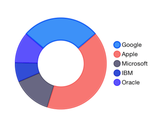

# Chart Series: Donut

TKChartDonutSeries derives from <code>TKChartPieSeries</code> and it represents a donut chart. The <code>innerRadius</code> property determines the width of the donut, and it is measured in values between 0 and 1. The higher value you set in the range between 0 and 1, the thinner the donut will be. For example, a value of 0.9 will make the donut chart take only 0.1 percent of the whole pie chart surface.

Here is an example of a donut chart:

<snippet id='chart-dnt'/>
<snippet id='chart-dnt-swift'/>
```C#
var pointsWithValueAndName = new List<TKChartDataPoint> ();
pointsWithValueAndName.Add (new TKChartDataPoint (new NSNumber (20), NSObject.FromObject ("Google")));
pointsWithValueAndName.Add (new TKChartDataPoint (new NSNumber (30), NSObject.FromObject ("Apple")));
pointsWithValueAndName.Add (new TKChartDataPoint (new NSNumber (10), NSObject.FromObject ("Microsoft")));
pointsWithValueAndName.Add (new TKChartDataPoint (new NSNumber (5), NSObject.FromObject ("IBM")));
pointsWithValueAndName.Add (new TKChartDataPoint (new NSNumber (8), NSObject.FromObject ("Oracle")));

var series = new TKChartDonutSeries(pointsWithValueAndName.ToArray());
series.InnerRadius = 0.5f;

chart.AddSeries(series);
chart.Legend.Hidden = false;
chart.Legend.Style.Position = TKChartLegendPosition.Right;
```



