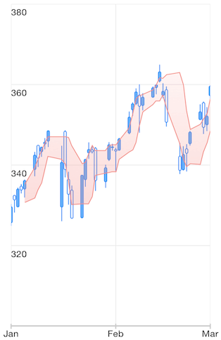
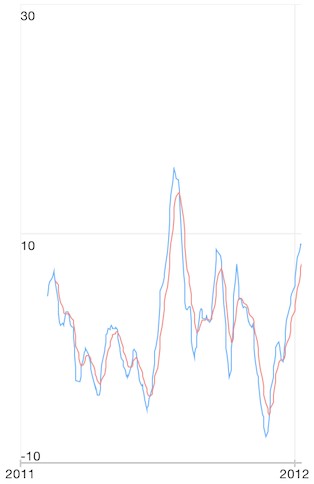

## Chart for Xamarin.iOS: Financial Indicators Series

This article provides a brief description and a list of the important properties of each indicator supported by TKChart. The indicators are divided in two groups - Technical Overlays and Technical Indicators. To set up a financial indicator, you have to initialize it with <code>TKChartCandlestickSeries</code> or <code>TKChartOhlcSeries</code> containing financial data.

## Technical Overlays##

Here is an example how to create a **Bollinger Band** indicator:

```C#
var candlesticks = new TKChartCandlestickSeries (financialDataPoints.ToArray ());
var bollingerBands = new TKChartBollingerBandIndicator (candlesticks);
financialChart.AddSeries (candlesticks);
financialChart.AddSeries (bollingerBands);
```



And here are the rest of the available Technical Overlays

- Simple Moving Average (SMA) - A simple moving average (SMA) is the unweighted mean of the previous n data. To use this indicator you should instantiate <code>TKChartSimpleMovingAverageIndicator</code> and change its <code>Period</code> property if needed. 
- Exponential Moving Average (EMA) - A type of moving average that is similar to a simple moving average, except that more weight is given to the latest data. Use <code>TKChartExponentialMovingAverageIndicator</code> class.
- Weighted Moving Average -  Weighted averages assign a heavier weighting to more current data points. Use <code>TKChartWeightedMovingAverageIndicator</code> class.
- Triangular Moving Average - The Triangular Moving Average is a double-smoothed Simple Moving Average that gives more weight to the middle section of the data interval. Use <code>TKChartTriangularMovingAverageIndicator</code> class.
- Modified Moving Average - Modified moving averages are similar to simple moving averages. The first point of the modified moving average is calculated the same way the first point of the simple moving average is calculated. However, all subsequent points are calculated by first adding the new price and then subtracting the last average from the resulting sum. The difference is the new point, or modified moving average. Use <code>TKChartModifiedMovingAverageIndicator</code> class.
- Adaptive Moving Average - uses three parameters to calculate its value: Period, SlowPeriod and FastPeriod. Use <code>TKChartAdaptiveMovingAverageIndicator</code> class.
- Bollinger Bands - volatility bands placed above and below a moving average. Use <code>TKChartBollingerBandIndicator</code> class.
- Moving Average Envelopes - percentage-based envelopes set above and below a moving average. Use <code>TKChartMovingAverageEnvelopesIndicator</code> class.
- Typical Price - the arithmetic average of the high, low, and closing prices for a given period. Use <code>TKChartTypicalPriceIndicator</code> class.
- Weighted Close - similar to Typical Price - the difference is that the weighted close place greater weighting on closing price. Use <code>TKChartWeightedCloseIndicator</code> class.
- Median Price -  the midpoint of each day's price. Use <code>TKChartMedianPriceIndicator</code> class.

## Technical Indicators##
Here is an example how to set up **Moving Average Convergence Divergence** indicator:

```C#
var candlesticks = new TKChartCandlestickSeries (financialDataPoints.ToArray());
var macdIndicator = new TKChartMACDIndicator (candlesticks);
macdIndicator.LongPeriod = 26;
macdIndicator.ShortPeriod = 12;
macdIndicator.SignalPeriod = 9;
financialChart.AddSeries (macdIndicator);
```



And here are the rest of the available Technical Indicators

- Moving Average Convergence Divergence - A trend-following momentum indicator that shows the relationship between two moving averages of prices. Use <code>TKChartMACDIndicator</code> class.
- Percentage Price Oscillator - a momentum oscillator that measures the difference between two moving averages as a percentage of the larger moving average. Use <code>TKChartPercentagePriceOscillator</code> class.
- Percentage Volume Oscillator - a momentum oscillator for volume. PVO measures the difference between two volume-based moving averages as a percentage of the larger moving average. Use <code>TKChartPercentageVolumeOscillator</code> class.
- Absolute Volume Oscillator - computes the difference between two average volume measures. Use <code>TKChartAbsoluteVolumeOscillator</code>.
- Relative Strength Index -  intended to chart the current and historical strength or weakness of a stock or market based on the closing prices of a recent trading period. Use <code>TKChartRelativeStrengthIndex</code> class.
- Relative Momentum Index - the aim of this indicator is to improve the data provided by the classical RSI indicator if the price reaches oversold/overbought areas. Use <code>TKChartRelativeMomentumIndex</code> class.
- Accumulation Distribution Line - a volume-based indicator designed to measure the cumulative flow of money into and out of a security. Use <code>TKChartAccumulationDistributionLine</code> class. 
- True Range - measures the daily range plus any gap from the closing price of the preceding day. Use <code>TKChartTrueRangeIndicator</code> class.
- Average True Range - an indicator that measures volatility. Use <code>TKChartAverageTrueRangeIndicator</code> class.
- Commodity Channel Index - measures a security’s variation from the statistical mean. Use <code>TKChartCommodityChannelIndex</code> class.
- Fast Stochastic Indicator - Stochastic Oscillator is a momentum indicator that shows the location of the close relative to the high - low range over a set number of periods. Use <code>TKChartFastStochasticIndicator</code> class.
- Slow Stochastic Indicator - The Slow Stochastic Oscillator smooths %K with a 3-day SMA, which is exactly what %D is in the Fast Stochastic Oscillator. Use <code>TKChartSlowStochasticIndicator</code> class.
- Full Stochastic Indicators - a fully customizable version of the Slow Stochastic Oscillator. Use <code>TKChartFullStochasticIndicator</code> class.
- Rate Of Change - a pure momentum oscillator that measures the percent change in price from one period to the next. Use <code>TKChartRateOfChangeIndicator</code> class.
- TRIX - a momentum oscillator that displays the percent rate of change of a triple exponentially smoothed moving average. Use <code>TKChartTRIXIndicator</code> class.
- Williams %R Indicator - a momentum indicator that is the inverse of the Fast Stochastic Oscillator. Use <code>TKChartWilliamsPercentIndicator</code> class.
- Ease Of Movement - a volume-based oscillator that fluctuates above and below the zero line. Use <code>TKChartEaseOfMovementIndicator</code> class.
- Detrended Price Oscillator - an indicator designed to remove trend from price and make it easier to identify cycles. Use <code>TKChartDetrendedPriceOscillator</code> class.
- Force Index -  an indicator used to illustrate how strong the actual buying or selling pressure is. Use <code>TKChartForceIndexIndicator</code> class.
- Rapid Adaptive Variance Indicator - measures trend intensity instead of trend direction. Use <code>TKChartRapidAdaptiveVarianceIndicator</code> class.
- Standard Deviation - a statistical term that measures the amount of variability or dispersion around an average. Use <code>TKChartStandardDeviationIndicator</code> class.
- On Balance Volume - measures buying and selling pressure as a cumulative indicator that adds volume on up days and subtracts volume on down days. Use <code>TKChartOnBalanceVolumeIndicator</code> class.
- Price Volume Trend - technical indicator consisting of a cumulative volume line that adds or subtracts a multiple of the percentage change in share price trend and current volume, depending upon their upward or downward movements. Use <code>TKChartPriceVolumeTrendIndicator</code> class.
- Positive Volume Index - an indicator that is based on days where trading volume has significantly increased from the previous day. Use <code>TKChartPositiveVolumeIndexIndicator</code> class.
- Negative Volume Index - a cumulative indicator that uses the change in volume to decide when the smart money is active. Use <code>TKChartNegativeVolumeIndexIndicator</code> class.
- Money Flow Index - an oscillator that uses both price and volume to measure buying and selling pressure. Use <code>TKChartMoneyFlowIndexIndicator</code> class.
- Ultimate Oscillator - a technical indicator that uses the weighted average of three different time periods to reduce the volatility and false transaction signals that are associated with many other indicators that mainly rely on a single time period. Use <code>TKChartUltimateOscillator</code> class.
- Market Facilitation Index -  designed for evaluation the willingness of the market to move the price. Use <code>TKChartMarketFacilitationIndex</code> class.
- Chaikin Oscillator - an oscillator which measures the accumulation distribution line of the MACD. Use <code>TKChartChaikinOscillator</code> class.


