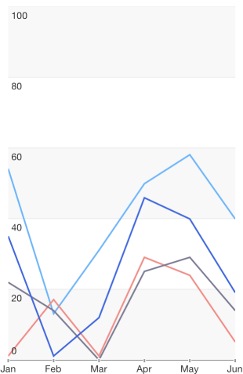
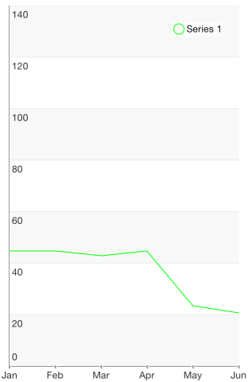

## Chart for Xamarin.iOS: Line Series

<code>TKChartLineSeries</code> plot their data points on Cartesian Area. Points are connected with straight lines. Here is how to set up a few line series:

```C#
var expensesData = new List<TKChartDataPoint> ();
var incomesData = new List<TKChartDataPoint> ();
var profitData = new List<TKChartDataPoint> ();

var categories = new [] { "Greetings", "Perfecto", "NearBy", "Family Store", "Fresh & Green" };
var expensesValues = new [] { 60, 30, 50, 32, 31 };
var incomesValues = new [] { 65, 75, 58, 59, 88 };
var profitValues = new [] { 5, 45, 8, 27, 57 };

for (int i = 0; i < categories.Length; ++i) {
    expensesData.Add (new TKChartDataPoint (new NSString (categories [i]), new NSNumber (expensesValues [i])));
    incomesData.Add (new TKChartDataPoint (new NSString (categories [i]), new NSNumber (incomesValues [i])));
    profitData.Add (new TKChartDataPoint (new NSString (categories [i]), new NSNumber (profitValues [i])));
}

var seriesForExpenses = new TKChartLineSeries(expensesData.ToArray());
seriesForExpenses.Title = "Expenses";
chart.AddSeries(seriesForExpenses);

var seriesForIncomes = new TKChartLineSeries(incomesData.ToArray());
seriesForIncomes.Title = "Incomes";
chart.AddSeries(seriesForIncomes);

var seriesForProfit = new TKChartLineSeries(profitData.ToArray());
seriesForProfit.Title = "Profit";
chart.AddSeries(seriesForProfit);
chart.Legend.Hidden = false;
```



## Configure input and selection of line series

If you would like to configure the distance between finger touch and line to perform selection, set <code>Selection</code> property:

```C#
series.Selection = TKChartSeriesSelection.Series;
```

If you would like to change the series' stroke, you should use the following code snippet:

```C#
var seriesForProfit = new TKChartLineSeries (profitData.ToArray());
seriesForProfit.Style.Palette = new TKChartPalette ();
var paletteItem = new TKChartPaletteItem ();
paletteItem.Stroke = new TKStroke (UIColor.Green);
seriesForProfit.Style.Palette.AddPaletteItem (paletteItem);
chart.AddSeries (seriesForProfit);
```



## Set null values visualization

In order to determines whether gaps should be displayed when there are nil values use <code>DisplayNilValuesAsGaps</code> property:

```C#
var seriesForProfit = new TKChartLineSeries (profitData.ToArray());
seriesForProfit.DisplayNilValuesAsGaps = true;
```