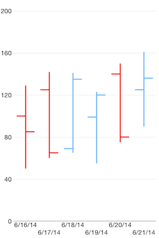
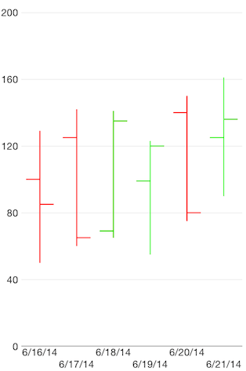

# Chart Series: OHLC

**TKChart** supports **Ohlc** stock series. This series operates with a special kind of data in the form of four parameters defining the stock market - open, high, low, and close. The high and low values show the price range (the highest and lowest prices) over one unit of time. The open and close values indicate the opening and closing price of the stock for the corresponding period. The width of the ohlc bar is determined by the period between 2 bars and the range of the axis. You sould use the <code>minorTickIntervalUnit</code> property of <code>TKChartDateTimeAxis</code> to change the period between 2 ohlc bars. Here is how to set up OHLC series:

<snippet id='chart-ohlc'/>
<snippet id='chart-ohlc-swift'/>
```C#
var openPrices = new [] { 100, 125, 69, 99, 140, 125 };
var closePrices = new [] { 85, 65, 135, 120, 80, 136 };
var lowPrices = new [] { 50, 60, 65, 55, 75, 90 };
var highPrices = new [] { 129, 142, 141, 123, 150, 161 };
var dateNow = NSDate.Now;
var financialDataPoints = new List<TKChartFinancialDataPoint> ();

for (int i = 0; i < openPrices.Length; ++i) {
    var date = dateNow.AddSeconds ((double)(60 * 60 * 24 * i));
    financialDataPoints.Add (new TKChartFinancialDataPoint (date, new NSNumber (openPrices [i]), new NSNumber (highPrices [i]),
        new NSNumber (lowPrices [i]), new NSNumber (closePrices [i]), null));
}

var ohlcSeries = new TKChartOhlcSeries (financialDataPoints.ToArray ());
chart.AddSeries (ohlcSeries);

var xAxis = chart.XAxis as TKChartDateTimeAxis;
xAxis.MinorTickIntervalUnit = TKChartDateTimeAxisIntervalUnit.Days;
xAxis.PlotMode = TKChartAxisPlotMode.BetweenTicks;
xAxis.MajorTickInterval = 1;
```



## Configure visual appearance of ohlc series

If you want to customize the appearance of ohlc series, you should implement the **TKChartDelegate** protocol as shown below::

<snippet id='chart-ohlc-visual'/>
<snippet id='chart-ohlc-visual-swift'/>
```C#
public override TKChartPaletteItem PaletteItemForSeries (TKChart chart, TKChartSeries series, nint index)
{
    var dataPoint = series.DataPointAtIndex ((uint)index);
    TKStroke stroke = null;
    if (dataPoint.Close.DoubleValue < dataPoint.Open.DoubleValue) {
        stroke = new TKStroke (UIColor.Red);
    } else {
        stroke = new TKStroke (UIColor.Green);
    }
    var paletteItem = new TKChartPaletteItem (stroke);
    return paletteItem;
}
```


