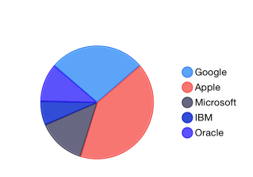
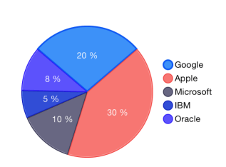
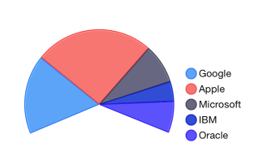

## Chart for Xamarin.iOS: Pie Series

Unlike all other series, <code>TKChartPieSeries</code> do not require axes. They visualize each data point as pie slices with arc size directly proportional to the magnitude of the raw data point's value. 

Pie slices represent data in one direction contrasting with the other series which represent data in two dimensions. Here is an example of how to create a pie chart with pie series populated with data:

```C#
var pointsWithValueAndName = new List<TKChartDataPoint> ();
pointsWithValueAndName.Add (new TKChartDataPoint (new NSNumber (20), null, "Google"));
pointsWithValueAndName.Add(new TKChartDataPoint(new NSNumber(30), null, "Apple"));
pointsWithValueAndName.Add (new TKChartDataPoint (new NSNumber (10), null, "Microsoft"));
pointsWithValueAndName.Add (new TKChartDataPoint (new NSNumber (5), null, "IBM"));
pointsWithValueAndName.Add (new TKChartDataPoint (new NSNumber (8), null, "Oracle"));

var series = new TKChartPieSeries (pointsWithValueAndName.ToArray());
series.Style.PointLabelStyle.TextHidden = false;

chart.AddSeries (series);
chart.Legend.Hidden = false;
chart.Legend.Style.Position = TKChartLegendPosition.Right;
```



## Configure visual appearance of pie series

Pie series can be customized using the following properties:

The <code>LabelDisplayMode</code> property controls whether to show labels inside or outside the pie series. The possible choices are:

- <code>TKChartPieSeriesLabelDisplayModeInside</code> - labels are displayed inside the pie.
- <code>TKChartPieSeriesLabelDisplayModeOutside</code> - labels are displayed outside the pie.

Other interesting options that can be used to customize pie labels are <code>StringFormat</code> and <code>Formatter</code> properties. For example, you can use the <code>Formatter</code> property in order to show slice values as text:

```C#
series.LabelDisplayMode = TKChartPieSeriesLabelDisplayMode.Inside;

var numberFormatter = new NSNumberFormatter ();
numberFormatter.NumberStyle = NSNumberFormatterStyle.SpellOut;
series.Style.PointLabelStyle.Formatter = numberFormatter;
```

Or use <code>StringFormat</code> property to format slice values as percents:

```C#
series.Style.PointLabelStyle.StringFormat = "%.0f %%";
```



The <code>OuterRadius</code> property can increase and decrease the diameter of the series. By default, it occupies the whole plot area and is equal to 1. Setting the outerRadius to 0.9 will decrease the radius of the series by 10 percent. Similarly, the value 1.1 will increase it. Leaving the property with value 1 will make the donut fill the available space.

The <code>ExpandRadius</code> property is used when selecting a pie segment. It defines the extent to which the selected pie segment is shifted. Again, this property is measured in percents. A value of 1.1 defines that the selected segment will expand by 10% of the pie radius.

The <code>StartAngle</code> and <code>endAngle</code> properties are used to define the pie range. The <code>StartAngle</code> sets the angle in radians from which the drawing of the pie segments will begin. Its default value is 0. The <code>EndAngle</code> determines whether the chart will appear as a full circle or a partial circle. Its default value is Pi*2.

The following code sets the startAngle and endAngle properties to show a half circle:

```C#
series.StartAngle = (float)(-Math.PI/4.0/2.0);
series.EndAngle = (float)(Math.PI/4.0/2.0);
series.RotationAngle = (float)Math.PI;
```



By default, the pie chart starts drawing its segments from 0 radians. You can customize this angle and rotate the chart. This is done by setting the <code>RotationAngle</code> property.

The <code>SelectionAngle</code> property is used to rotate the chart when selecting a pie segment. It rotates the chart so that the selected pie segment appears at the specified by the property angle.

In order to select the second pie segment, call the select method of TKChart:

```C#
series.Selection = TKChartSeriesSelection.DataPoint;
chart.Select(new TKChartSelectionInfo(series, 1));
```

Further information about selection in chart is available in the [Chart for Xamarin.iOS: Selection](../selection) article.
