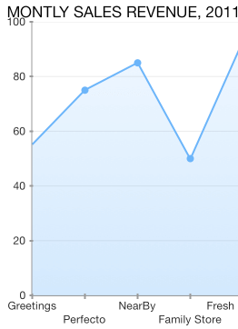
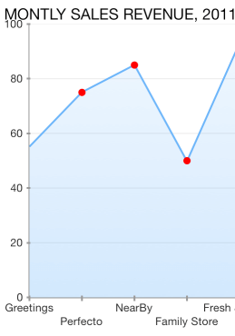

## Chart for Xamarin.iOS: Series Points Customization

<code>TKChartSeries</code> can draw a point in particular shape. You can customize the appearance and shape of this point by accessing and altering the styling properties and palette items for <code>ShapePallete</code> style property.

Note that the approach above is applicable to any series except <code>TKChartPieSeries</code>, <code>TKChartBarSeries</code> and <code>TKChartColumnSeries</code>. If you want to change the shape of each point, you should use the following code snippet:

```C#
series.Style.PointShape = new TKPredefinedShape (TKShapeType.Circle, new SizeF (10, 10));
```



You can specify many predefined shapes by using the <code>TKShapeType</code> enum. The available options are listed below:

- TKShapeType.None - No shape
- TKShapeType.Square - Square shape
- TKShapeType.Circle - Circle shape
- TKShapeType.TriangleUp - Triangle pointing up
- TKShapeType.TriangleDown - Triangle pointing down
- TKShapeType.Diamond - Diamond shape
- TKShapeType.Rhombus - Rhombus shape
- TKShapeType.Pentagon - Pentagon shape
- TKShapeType.Hexagon - Hexagon shape
- TKShapeType.Star - Star shape
- TKShapeType.Heart - Heart shape

In addition, you can change a point background color by using the following lines of code:

```C#
var paletteItem = new TKChartPaletteItem ();
paletteItem.Fill = new TKSolidFill (UIColor.Red);
var palette = new TKChartPalette ();
palette.AddPaletteItem (paletteItem);
series.Style.ShapePalette = palette;
```




