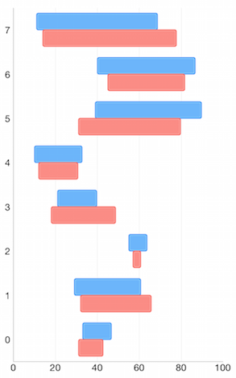
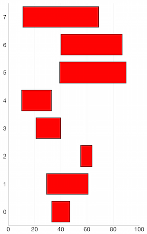
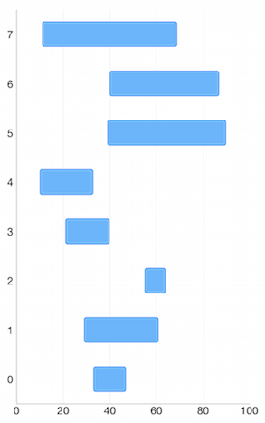

# Chart Series: Range Bar

<code>TKChartRangeBarSeries</code> are used to visualize data points as horizontal bars where the width of each bar denotes the difference between data point's low and high value. The code snippet below demonstrates how to create range bar series.

## Configure clustering of range bar series

If you want to cluster multiple range bar series side by side, they should use a shared y-axis:

<snippet id='chart-range-bar'/>
<snippet id='chart-range-bar-swift'/>
```C#
var lowValues = new NSNumber[] {
    new NSNumber (33), new NSNumber (29),
    new NSNumber (55), new NSNumber (21),
    new NSNumber (10), new NSNumber (39),
    new NSNumber (40), new NSNumber (11)
};

var highValues = new NSNumber[] {
    new NSNumber (47), new NSNumber (61),
    new NSNumber (64), new NSNumber (40),
    new NSNumber (33), new NSNumber (90),
    new NSNumber (87), new NSNumber (69)
};


var lowValues2 = new NSNumber[] {
    new NSNumber (31), new NSNumber (32),
    new NSNumber (57), new NSNumber (18),
    new NSNumber (12), new NSNumber (31),
    new NSNumber (45), new NSNumber (14)
};

var highValues2 = new NSNumber[] {
    new NSNumber (43), new NSNumber (66),
    new NSNumber (61), new NSNumber (49),
    new NSNumber (31), new NSNumber (80),
    new NSNumber (82), new NSNumber (78)
};

List<TKChartRangeDataPoint> list = new List<TKChartRangeDataPoint> ();
List<TKChartRangeDataPoint> list2 = new List<TKChartRangeDataPoint> ();
for (int i = 0; i < 8; i++) {
    list.Add(TKChartRangeDataPoint.RangeBarDataPoint(new NSNumber(i), lowValues[i], highValues[i]));
    list2.Add(TKChartRangeDataPoint.RangeBarDataPoint(new NSNumber(i), lowValues2[i], highValues2[i]));
}

TKChartRangeBarSeries series = new TKChartRangeBarSeries (list.ToArray());
TKChartRangeBarSeries series2 = new TKChartRangeBarSeries (list2.ToArray());
chart.AddSeries(series);
chart.AddSeries(series2);
```



## Configure visual appearance

If you want to customize the appearance of a range bar series, you should change its <code>style</code> properties.

You can change the fill and stroke in the following manner:

<snippet id='chart-range-bar-visual'/>
<snippet id='chart-range-bar-visual-swift'/>
```C#
series.Style.Palette = new TKChartPalette();
var paletteItem = new TKChartPaletteItem ();
paletteItem.Fill = new TKSolidFill (UIColor.Red);
paletteItem.Stroke = new TKStroke (UIColor.Black);
series.Style.Palette.AddPaletteItem (paletteItem);
chart.AddSeries(series);
```



You can change the gap between the bars with the following code snippet:

<snippet id='chart-range-bar-gap'/>
<snippet id='chart-range-bar-gap-swift'/>
```C#
series.GapLength = 0.5f;
```



If you need to limit the height of the bars you can set the series <code>maxBarHeight</code> and <code>minBarHeight</code> properties. These properties allow you to have required minimum and possible maximum height for your series.

<snippet id='chart-range-bar-height'/>
<snippet id='chart-range-bar-height-swift'/>
```C#
series.MinBarHeight = 20;
series.MaxBarHeight = 50;
```
