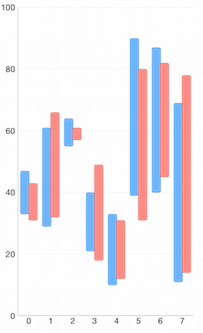
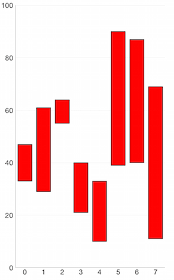
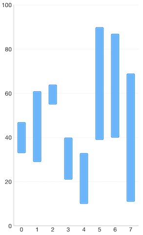

# Chart Series: Range Column

<code>TKChartRangeColumnSeries</code> are used to visualize data points as column blocks where the height of each column denotes the difference between data point's low and high value. The code snippet below demonstrates how to create range column series.

## Configure clustering of range column series

If you want to cluster multiple range column series side by side, they should use a shared x-axis:

<snippet id='chart-range-col-cluster'/>
<snippet id='chart-range-col-cluster-swift'/>
```C#
var lowValues = new NSNumber[] {
    new NSNumber (33), new NSNumber (29),
    new NSNumber (55), new NSNumber (21),
    new NSNumber (10), new NSNumber (39),
    new NSNumber (40), new NSNumber (11)
};

var highValues = new NSNumber[] {
    new NSNumber (47), new NSNumber (61),
    new NSNumber (64), new NSNumber (40),
    new NSNumber (33), new NSNumber (90),
    new NSNumber (87), new NSNumber (69)
};

var lowValues2 = new NSNumber[] {
    new NSNumber (31), new NSNumber (32),
    new NSNumber (57), new NSNumber (18),
    new NSNumber (12), new NSNumber (31),
    new NSNumber (45), new NSNumber (14)
};

var highValues2 = new NSNumber[] {
    new NSNumber (43), new NSNumber (66),
    new NSNumber (61), new NSNumber (49),
    new NSNumber (31), new NSNumber (80),
    new NSNumber (82), new NSNumber (78)
};

List<TKChartRangeDataPoint> list = new List<TKChartRangeDataPoint> ();
List<TKChartRangeDataPoint> list2 = new List<TKChartRangeDataPoint> ();
for (int i = 0; i < 8; i++) {
    list.Add(TKChartRangeDataPoint.RangeColumnDataPoint(new NSNumber(i), lowValues[i], highValues[i]));
    list2.Add(TKChartRangeDataPoint.RangeColumnDataPoint(new NSNumber(i), lowValues2[i], highValues2[i]));
}

TKChartRangeColumnSeries series = new TKChartRangeColumnSeries (list.ToArray());
TKChartRangeColumnSeries series2 = new TKChartRangeColumnSeries (list2.ToArray());
chart.AddSeries(series);
chart.AddSeries(series2);
```



## Configure visual appearance

If you want to customize the appearance of a range column series, you should change its <code>style</code> properties.

You can change the fill and stroke in the following manner:

<snippet id='chart-range-col-visual'/>
<snippet id='chart-range-col-visual-swift'/>
```C#
series.Style.Palette = new TKChartPalette();
var paletteItem = new TKChartPaletteItem ();
paletteItem.Fill = new TKSolidFill (UIColor.Red);
paletteItem.Stroke = new TKStroke (UIColor.Black);
series.Style.Palette.AddPaletteItem (paletteItem);
```



You can change the gap between the columns with the following code snippet:

<snippet id='chart-range-col-gap'/>
<snippet id='chart-range-col-gap-swift'/>
```C#
series.GapLength = 0.5f;
```



If you need to limit the width of the columns you can set the series <code>maxColumnWidth</code> and <code>minColumnWidth</code> properties. These properties allow you to have required minimum and possible maximum width for your series.

<snippet id='chart-range-col-width'/>
<snippet id='chart-range-col-width-swift'/>
```C#
series.MinColumnWidth = 20;
series.MaxColumnWidth = 50;
```
