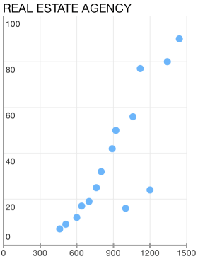
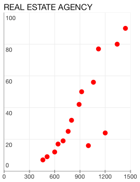

## Chart for Xamarin.iOS: Scatter Series

<code>TKChartScatterSeries</code> plots its data along two axes. Scatter series identify the position of each point using two dimensional values - XValue and YValue for the horizontal and vertical axes respectively, just like in the typical Cartesian coordinate system. 

Here is how to create a TKChartScatterSeries and populate them manually:

```C#
List<TKChartDataPoint> list = new List<TKChartDataPoint> ();
for (int j = 0; j < 20; j++) {

    list.Add(new TKChartDataPoint (new NSNumber (r.Next() % 1450), new NSNumber (r.Next () % 150)));
}

TKChartScatterSeries series = new TKChartScatterSeries (list.ToArray());
```



## Customizing the visual appearance##

In addition, you can change a point background color by using the following lines of code:

<snippet id='chart-scatter-visual'/>
<snippet id='chart-scatter-visual-swift'/>
```C#
var series = new TKChartScatterSeries (scatterPoints.ToArray());
var paletteItem = new TKChartPaletteItem();
paletteItem.Fill = new TKSolidFill (UIColor.Red);
series.Style.Palette = new TKChartPalette();
series.Style.Palette.AddPaletteItem (paletteItem);
chart.AddSeries (series);
```



## Configure input and selection of line series##

Here is how to configure the distance between finger touch and line to perform selection:

```C#
var series = new TKChartScatterSeries (scatterPoints.ToArray());
series.Selection = TKChartSeriesSelection.DataPoint;
series.MarginForHitDetection = 30.0f;
chart.AddSeries (series);
```


