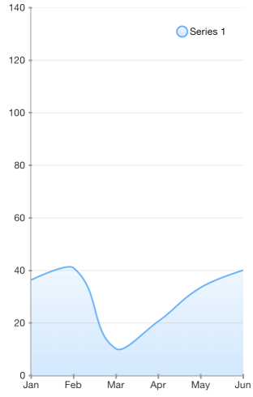

## Chart for Xamarin.iOS: Spline Area Series

<code>TKChartSplineAreaSeries</code> series is a derivative of TKChartAreaSeries. It allows the area between the curve and the corresponding axis to be colored in an arbitrary way. Below is a sample snippet that demonstrates how to set up a spline series:

```C#
var categories = new [] { "Greetings", "Perfecto", "NearBy", "Family Store", "Fresh & Green" };
var values = new [] { 70, 75, 58, 59, 88 };
var pointsWithCategoriesAndValues = new List<TKChartDataPoint> ();
for (int i = 0; i < categories.Length; ++i) {
    pointsWithCategoriesAndValues.Add (new TKChartDataPoint (new NSString (categories [i]), new NSNumber (values [i])));
}
chart.AddSeries (new TKChartSplineAreaSeries (pointsWithCategoriesAndValues.ToArray ()));
```



