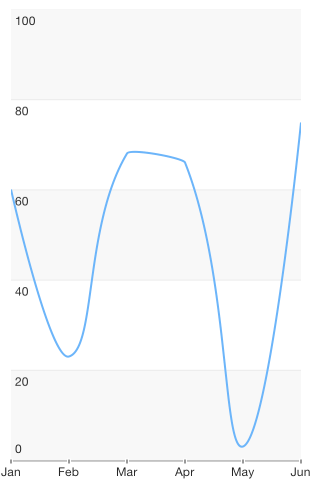

## Chart for Xamarin.iOS: Spline Series

<code>TKChartSpineSeries</code> is similar to the line series, but instead of straight line segments, the spline series connects its data points with smooth curves which represent rough approximations of the missing data points. 

Here is an example of a chart with a spline series:

```C#
var profitData = new List<TKChartDataPoint> ();
var profitValues = new [] { 10, 45, 8, 27, 57 };
var categories = new [] { "Greetings", "Perfecto", "NearBy", "Family Store", "Fresh & Green" };
for (int i = 0; i < categories.Length; ++i) {
    profitData.Add(new TKChartDataPoint(new NSString(categories[i]), new NSNumber(profitValues[i])));
}

chart.AddSeries(new TKChartSplineSeries(profitData.ToArray()));
```



As TKChartSplineSeries derives from TKChartLineSeries, it shares the same functionality. For more details go to [Chart for Xamarin.iOS: Line Series](/devtools/xamarin/nativecontrols/ios/chart/series/line).
