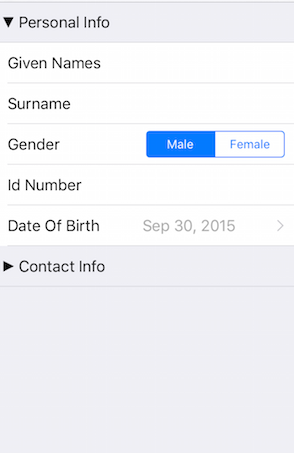

# DataForm: Collapsible Groups



TKDataForm supports expand/collpase behavior for its property groups when the group's header is tapped. To allow exapnding and collapsing groups, you should implement <code>dataForm:updateGroupView:forGroupAtIndex:</code> of <code>TKDataFormDelegate</code> and set the <code>collapsible</code> property of the group view:

<snippet id='dataform-collapse'/>
<snippet id='dataform-collapse-swift'/>
```C#
public override void UpdateGroupView (TKDataForm dataForm, TKEntityPropertyGroupView groupView, uint groupIndex)
{
    groupView.Collapsible = true;
    groupView.TitleView.Style.SeparatorColor = new TKSolidFill (new UIColor (0.784f, 0.780f, 0.8f, 1.0f));
}
```

