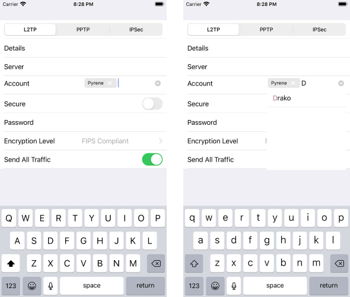

## RadDataForm for Xamarin.iOS: Built-in Editors

RadDataForm for Xamarin.iOS contains many built-in property editors that are either automatically resolved depending on the property's type or can be set by the **TKDataFormEntityDataSourceHelper** `EditorClass` of the **TKDataForm**. RadDataForm currently ships with the following built-in editors:

- TKDataFormAutocompleteInlinEditor
- TKDataFormTextFieldEditor
- TKDataFormMultilineTextEditor
- TKDataFormEmailEditor
- TKDataFormPasswordEditor
- TKDataFormNamePhoneEditor
- TKDataFormPhoneEditor
- TKDataFormDecimalEditor
- TKDataFormNumberEditor
- TKDataFormSwitchEditor
- TKDataFormStepperEditor
- TKDataFormSliderEditor
- TKDataFormSegmentedEditor
- TKDataFormInlineEditor
- TKDataFormDatePickerEditor
- TKDataFormTimePickerEditor
- TKDataFormOptionsEditor
- TKDataFormPickerViewEditor
- TKDataFormCustomEditor

>tip For more details on how you can define and customize the editors check the [Getting Started](/devtools/xamarin/nativecontrols/ios/dataform/getting-started) topic.

### Using the TKDataFormAutoCompleteInlineEditor

TKDataFormAutoCompleteInlineEditor is a bit more advanced editor which provides an out of the box quick search functionality. This editor uses the **TKAutoCompleteTextView** standalone element and all its functionality like `DisplayMode` is available to the RadDataForm editor.

#### Setting the suggestions 'Source'

Because of the nature of the RadAutoCompleteTextView the editor which exposes its functionality requires some additional data to be passed to it which will be used as the 'suggestions' when a user starts typing in its textbox. Suggestions can be set through the `ValuesProvider` property of the **TKDataFormEntityDataSourceHelper** and setting it to array of strings. 

The example below uses the setup from the [Getting Started](/devtools/xamarin/nativecontrols/ios/dataform/getting-started) topic.

```C#
var dataSource = new TKDataFormEntityDataSourceHelper(new PersonalInfo());
 
dataSource["Account"].EditorClass = new Class(typeof(TKDataFormAutoCompleteInlineEditor));        
dataSource["Account"].ValuesProvider = NSArray.FromStrings(new string[] { "CMOK", "Drako", "Falkor", "Longma", "Pyrene" });
```

#### Setting the DisplayMode

If you are familiar with the TKAutoCompleteTextView element you know that is supports out of the box two different selected items display modes:

- Token - the selected item from the 'suggestion box' is displayed as a box with a remove 'X' button
- Plain - the selected item's text is appended and autocompleted after an item from the 'suggestion box' is selected

When using the `DataFormRadAutoCompleteInlineEditor` you too have the option to change the editor's `DisplayMode` by simply setting the `AutoCompleteDisplayMode` of the AutoCompleteTextView control inside the <code>UpdateEditor</code> method of the DataForm Delegate:

```C#
class MydDataFormDelegate : TKDataFormDelegate
{
    public override void UpdateEditor(TKDataForm dataForm, TKDataFormEditor editor, TKEntityProperty property)
    {
        if(property.Name == "Account")
        {
            (editor as TKDataFormAutoCompleteInlineEditor).AutoCompleteView.DisplayMode = TKAutoCompleteDisplayMode.Tokens;
        }   
    }  
}
```

Here is the result:

