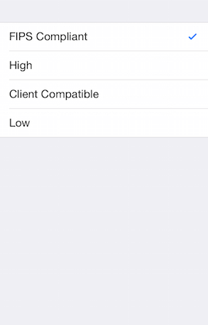

## DataForm for Xamarin.iOS: Getting Started

This quick start tutorial demonstrates how you can add <code>TKDataForm</code> to your Xamarin.iOS application. 

## Setting up TKDataForm

There are two approaches you can use - either add a <code>TKDataForm</code> instance to an existing UIViewController or utilize our predefined <code>TKDataFormViewController</code>. 

Either way you choose, first you will need to reference Telerik.Xamarin.iOS.dll into the Xamarin.iOS project.

### Adding TKDataForm instance

Open your **UIViewController** file and add a reference to the <code>TelerikUI</code> namespace:

```C#
using TelerikUI;
```

You should create a business object that will be displayed and edited by <code>TKDataForm</code>. Let's create a class called <code>PersonalInfo</code>:

```C#
public class PersonalInfo : NSObject
{
    [Export("Server")]
    public string Server { get; set;}

    [Export("Details")]
    public string Details { get; set;}

    [Export("Account")]
    public string Account { get; set;}

    [Export("Secure")]
    public bool Secure { get; set;}

    [Export("Password")]
    public string Password { get; set;}

    [Export("EncryptionLevel")]
    public int EncryptionLevel { get; set;}

    [Export("SendAllTraffic")]
    public bool SendAllTraffic { get; set;}

    [Export("InfoProtocol")]
    public int InfoProtocol{ get; set;}

    public PersonalInfo ()
    {
        this.InfoProtocol = 0;
        this.Details = "";
        this.Server = "";
        this.Secure = false;
        this.Password = "";
        this.EncryptionLevel = 0;
        this.Account = "";
        this.SendAllTraffic = true;
    }
}
```

The <code>TKDataForm</code> object should be created in <code>ViewDidLoad</code> method of the UIViewController:

```C#
public override void ViewDidLoad ()
{
    base.ViewDidLoad ();
    // Perform any additional setup after loading the view, typically from a nib.
    var dataForm = new TKDataForm(this.View.Bounds)
    {
        WeakDataSource = new TKDataFormEntityDataSource(new PersonalInfo())
    };  
    this.View.AddSubview(dataForm);
}
```

And here is the result:


### Utilizing TKDataFormViewController

The other option is to utilize the <code>TKDataFormViewController</code> - it inherits from `UIViewController` and contains a predefined <code>TKDataForm</code> instance.

For the example below the same <code>PersonalInfo</code> class is used as a source of the DataForm.

```C#
public partial class MyViewController : TKDataFormViewController
{
	public MyViewController(IntPtr handle) : base(handle)
	{
	}

	public override void ViewDidLoad()
	{
		base.ViewDidLoad();

		// Perform any additional setup after loading the view, typically from a nib.
		this.DataForm.WeakDataSource = new TKDataFormEntityDataSource(new PersonalInfo());         
	}
}
```

## Customize the editors

TKDataForm chooses a default editor based on each property's type. You have the option to change the default editors by utilizing the <code>TKDataFormEntityDataSourceHelper</code> class and set it as the DataSource of the DataForm. <code>TKDataFormEntityDataSourceHelper</code> gives access to each dataform entity for each property of the source object, so you can modify its editor, provide predefined values, and more.

In addition, if you would like to customize the editors, you would need to adopt <code>TKDataFormDelegate</code> and override its <code>UpdateEditor</code> method. Then you just need to set thus created delegate to the <code>Delegate</code> property of the TKDataForm instance.

Check below an example of <code>TKDataFormEntityDataSourceHelper</code> and <code>TKDataFormDelegate</code>:

```C#
public override void ViewDidLoad ()
{
    base.ViewDidLoad ();
    // Perform any additional setup after loading the view, typically from a nib.

    var dataSource = new TKDataFormEntityDataSourceHelper(new PersonalInfo());          
        
    dataSource["Password"].EditorClass = new Class(typeof(TKDataFormPasswordEditor));
    dataSource["InfoProtocol"].ValuesProvider = NSArray.FromStrings(new string[] { "L2TP", "PPTP", "IPSec" });
    dataSource["EncryptionLevel"].ValuesProvider = NSArray.FromStrings(new string[] { "FIPS Compliant", "High", "Client Compatible", "Low" });

    dataSource.AddGroup(" ", new string[] { "InfoProtocol" });
    dataSource.AddGroup(" ", new string[] {  "Details", "Server", "Account", "Secure", "Password", "EncryptionLevel", "SendAllTraffic" });        

    var dataForm = new TKDataForm(this.View.Bounds)
    {
        BackgroundColor = new UIColor(0.937f, 0.937f, 0.960f, 1.0f),
        GroupSpacing = 20,
        Delegate = new MydDataFormDelegate(),
        WeakDataSource = dataSource.NativeObject
    };      
    this.View.AddSubview(dataForm);
}
```

where MydDataFormDelegate is defined as below:

```C#
class MydDataFormDelegate : TKDataFormDelegate
{
    public override void UpdateEditor(TKDataForm dataForm, TKDataFormEditor editor, TKEntityProperty property)
    {
        TKGridLayoutCellDefinition feedbackDef = editor.GridLayout.DefinitionForView(editor.FeedbackLabel);
        editor.GridLayout.SetHeight(0, feedbackDef.Row.Int32Value);

        if (property.Name == "InfoProtocol")
        {
            editor.Style.TextLabelDisplayMode = TKDataFormEditorTextLabelDisplayMode.Hidden;
            TKGridLayoutCellDefinition textLabelDef = editor.GridLayout.DefinitionForView(editor.TextLabel);
            editor.GridLayout.SetWidth(0, textLabelDef.Column.Int32Value);
        }

        if (editor.IsKindOfClass(new Class(typeof(TKDataFormTextFieldEditor))) && !(property.Name.Equals("Password")))
        {
            property.HintText = "Required";
        }
    }
}
```

The images below show the result after applying the snippet:

<table>
	<tr>
		<td></td>
		<td></td>
	</tr>
</table>
