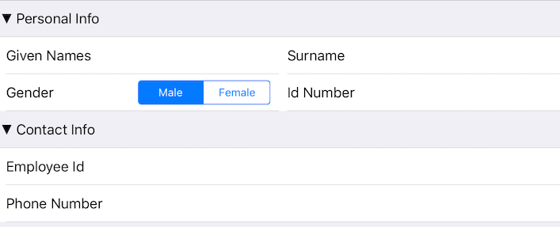

# DataForm: Group Layouts



<code>TKEntityPropertyGroupView</code> allows you to arrange the editors in the group using different layouts that confirm to <code>TKLayout</code> protocol through its <code>layout</code> property. By default the group view uses <code>TKStackLayout</code>, but you could easily change it to let's say <code>TKGridLayout</code>. The code snippet below shows how to change the layout of a group view:

<snippet id='dataform-groups-layout'/>
<snippet id='dataform-groups-layout-swift'/>
```C#
groupView.Collapsible = true;
if (groupIndex == 0) {
    TKGridLayout grid = new TKGridLayout ();
    groupView.EditorsContainer.Layout = grid;
    int row = 0;
    int col = 0;
    foreach (UIView editor in groupView.EditorsContainer.Items) {
        TKGridLayoutCellDefinition editorDefinition = grid.DefinitionForView (editor);
        editorDefinition.Row = new NSNumber (row);
        editorDefinition.Column = new NSNumber (col);
        col++;
        if (col == 2) {
            row++;
            col = 0;
        }
    }
}
```
