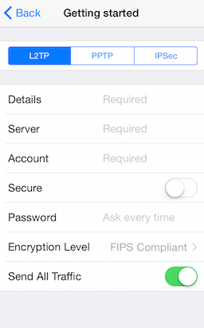

# DataForm: Overview

DataForm for iOS is customizable component that allows you to easily create a form for collecting or editing business object data. It is ideal for settings or registration/login pages. TKDataForm supports different commit modes allowing you to commit property values one by one or commit the whole form at once. You could also determine at what moment the properties should be validated choosing between three validation modes. The control lets you use rich set of editors out of the box.

**Editors**

- TextField
- Switch
- Stepper
- Slider
- Segmented control
- DatePicker
- PickerView
- Options

**Commit and validation modes**

- Immediate
- On lost focus
- Delayed

The commit and validation modes can be combined allowing you to perform validation and commit at different moment.