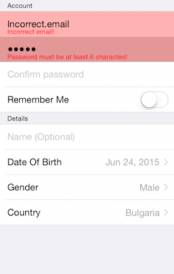

# TKDataForm: Validation



## Validation Modes

TKDataForm supports three validation mdoes:

- Immediate - validation will be performed every time the property value is changed.
- OnLostFocus - validation will be performed when the editor focus is changed to another editor.
- Delayed - validation will be performed explicitly whe <code>commit</code> method of <code>TKDataForm</code> is called. Note that this option is used only with commit mode <code>TKDataFormCommitModeDelayed</code>

Here is an example how to set a validation mode to <code>TKDataForm</code>:

<snippet id='dataform-validation'/>
<snippet id='dataform-validation-swift'/>
```C#
this.DataForm.ValidationMode = TKDataFormValidationMode.Immediate;
```

## Validating TKDataFormEntityProperty

There are 2 options to validate a property - using TKDataFormDelegate or using validators that adopt TKDataFormValidator protocol.

### Adopting TKDataFormValidator

<code>TKDataFormValidator</code> protocol has 2 required methods - <code>validateProperty:</code> and <code>validationMessage</code>. <code>validateProperty</code> method is used to perform the actual validation and return a boolean value indicating if the property value is valid. The <code>validationMessage</code> method should return a feedback message that will be displayed to the user of your application. After you implement a vlidator you should set the <code>validators</code> property of the <code>TKDataFormEntityProperty</code> that will be validated:

<snippet id='dataform-password'/>
<snippet id='dataform-password-swift'/>
```C#
TKDataFormMinimumLengthValidator passwordValidator = new TKDataFormMinimumLengthValidator (6);
passwordValidator.ErrorMessage = "Password must be at least 6 characters!";
password.Validators = new NSObject[] { passwordValidator };
```

### Validating through TKDataFormDelegate

To validate a property through <code>TKDataFormDelegate</code> you should implement its <code>dataForm:validateProperty:editor:</code> that returns a boolean value indicating if the property value is valid:

<snippet id='dataform-validate'/>
<snippet id='dataform-validate-swift'/>
```C#
public override bool ValidateProperty (TKDataForm dataForm, TKEntityProperty property, TKDataFormEditor editor)
{
```

## Check for validation errors

When you want to simply check if there are any validation errors in the <code>TKDataForm</code> you can use the <code>hasValidationErrors</code> method. The next code snippet shows how to call the method from the <code>TKDataFormViewController</code>:

<snippet id='dataform-has-validation-errors'/>
<snippet id='dataform-has-validation-errors-swift'/>