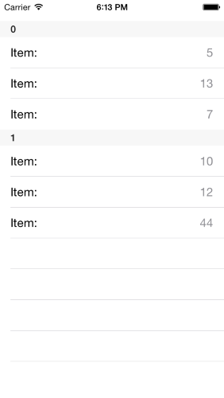
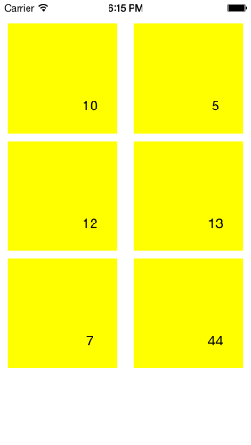
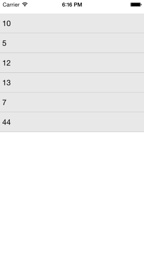
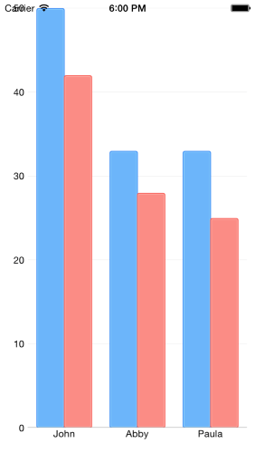
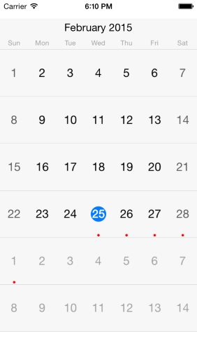

## DataSource for Xamarin.iOS: Binding with UI Controls

<code>TLKDataSource</code> works well with data enabled controls and provides an easy way to shape and present your data. The currently supported UI controls are:

- UITableView
- UICollectionView
- TKListView
- TKChart
- TKCalendar

This article describes how to bind <code>TLKDataSource</code> and customize those controls.

## UITableView ##



Setting the <code>DataSource</code> property is enough in order to present data in <code>UITableView</code>. <code>TLKDataSource</code> will take care of the implementation of all methods in <code>UITableViewDataSource</code> protocol:

<snippet id='datasource-tableview-ui'/>
<snippet id='datasource-tableview-ui-swift'/>
```C#
NSObject[] array = new NSObject[] {
    NSObject.FromObject (10),
    NSObject.FromObject (5),
    NSObject.FromObject (12),
    NSObject.FromObject (13),
    NSObject.FromObject (7),
    NSObject.FromObject (44)
};

this.dataSource = new TLKDataSource (array);

CGRect rect = this.View.Bounds;
rect.Inflate (0, -30);
UITableView table = new UITableView (rect);
table.AutoresizingMask = UIViewAutoresizing.FlexibleWidth | UIViewAutoresizing.FlexibleHeight;
table.DataSource = this.dataSource;
this.View.AddSubview (table);
```

You can set <code>DisplayKey</code> and <code>ValueKey</code> properties to specify what to display in table view cells:

<snippet id='datasource-displaykey'/>
<snippet id='datasource-displaykey-swift'/>
```C#
NSMutableArray items = new NSMutableArray();
items.Add (new DSItem () { Name = "John", Value = 50, Group = "A" });
items.Add (new DSItem () { Name = "Abby", Value = 33, Group = "A" });
items.Add (new DSItem () { Name = "Smith", Value = 42, Group = "B" });
items.Add (new DSItem () { Name = "Peter", Value = 28, Group = "B" });
items.Add (new DSItem () { Name = "Paula", Value = 25, Group = "B" });

this.dataSource = new TLKDataSource ();
this.dataSource.ItemSource = items;
this.dataSource.DisplayKey = "Name";
```

In the majority of the scenarios you will also need to customize the cells. In this case you can implement the <code>InitCell</code> block from <code>TKDataSourceTableViewSettings</code> class:

<snippet id='datasource-cell-init'/>
<snippet id='datasource-cell-init-swift'/>
```C#
this.dataSource.Settings.TableView.InitCell ((UITableView tableView, NSIndexPath indexPath, UITableViewCell cell, NSObject item) => {
    cell.TextLabel.Text = "Item:";
    cell.DetailTextLabel.Text = this.dataSource.TextFromItem(item, null);
});
```

If this is not enough to achieve to look you want, you can create your custom cells by using the <code>CreateCell</code> block function:

<snippet id='datasource-cell-create'/>
<snippet id='datasource-cell-create-swift'/>
```C#
this.dataSource.Settings.TableView.CreateCell ((UITableView tableView, NSIndexPath indexPath, NSObject item) => {
    UITableViewCell cell = tableView.DequeueReusableCell("cell");
    if (cell == null) {
        cell = new UITableViewCell(UITableViewCellStyle.Value1, "cell");
    }
    return cell;
});
```

<code>TLKDataSource</code> will take care of everything and no code is necessary even when your data is grouped:


<snippet id='datasource-cell-group'/>
<snippet id='datasource-cell-group-swift'/>
```C#
this.dataSource.Group ((NSObject item) => {
    return NSObject.FromObject(((NSNumber)item).Int32Value % 2 == 0);
});
```

## UICollectionView ##



<code>TLKDataSource</code> integrates well with <code>UICollectionView</code>. Just set the <code>DataSource</code> property and prepare the collection view:

<snippet id='datasource-collectionview-ui'/>
<snippet id='datasource-collectionview-ui-swift'/>
```C#
var layout = new UICollectionViewFlowLayout();
layout.ItemSize = new CGSize (140, 140);

CGRect rect = this.View.Bounds;
rect.Inflate (0, -30);
var collectionView = new UICollectionView (rect, layout);
collectionView.AutoresizingMask = UIViewAutoresizing.FlexibleWidth | UIViewAutoresizing.FlexibleHeight;
collectionView.DataSource = this.dataSource;
collectionView.BackgroundColor = UIColor.White;
this.View.AddSubview(collectionView);
```

Use the collection view settings class and its <code>InitCell</code> in case you want to customize the cell appearance:

<snippet id='datasource-collectionview-cell-init'/>
<snippet id='datasource-collectionview-cell-init-swift'/>
```C#
this.dataSource.Settings.CollectionView.InitCell ((UICollectionView collection, NSIndexPath indexPath, UICollectionViewCell cell, NSObject item) => {
    var tkCell = cell as TKCollectionViewCell;
    tkCell.Label.Text = this.dataSource.TextFromItem(item, null);
    tkCell.BackgroundColor = UIColor.Yellow;
});
```

## TKListView ##



You can also easily use <code>TKListView</code> with <code>TLKDataSource</code>:

<snippet id='datasource-listview-ui'/>
<snippet id='datasource-listview-ui-swift'/>
```C#
CGRect rect = this.View.Bounds;
rect.Inflate (0, -30);
var listView = new TKListView (rect);
listView.AutoresizingMask = UIViewAutoresizing.FlexibleWidth | UIViewAutoresizing.FlexibleHeight;
this.dataSource.SetDataSourceFor (listView);
this.View.AddSubview (listView);
```

The <code>InitCell</code> and <code>CreateCell</code> methods can be used to customize the cell appearance:

<snippet id='datasource-listview-cell-create'/>
<snippet id='datasource-listview-cell-create-swift'/>
```C#
this.dataSource.Settings.ListView.CreateCell ((TKListView list1, NSIndexPath indexPath, NSObject item) => {
    return list1.DequeueReusableCell("myCustomCell", indexPath) as TKListViewCell;
});

this.dataSource.Settings.ListView.InitCell ((TKListView list2, NSIndexPath indexPath, TKListViewCell cell, NSObject item) => {
    cell.TextLabel.Text = this.dataSource.TextFromItem(item, null);
    (cell.BackgroundView as TKView).Fill = new TKSolidFill(new UIColor(0.1f, 0.1f, 0.1f, 0.1f));
});
```

## TKChart ##



In order to present data in <code>TKChart</code>, you need to set the <code>DisplayKey</code> and <code>ValueKey</code> properties. The <code>DisplayKey</code> defines the x-axis values, and the <code>ValueKey</code> defines the y-axis values:

<snippet id='datasource-chart-ui'/>
<snippet id='datasource-chart-ui-swift'/>
```C#
NSMutableArray items = new NSMutableArray ();
items.Add (new DSItem () { Name = "John", Value = 50, Group = "A" });
items.Add (new DSItem () { Name = "Abby", Value = 33, Group = "A" });
items.Add (new DSItem () { Name = "Paula", Value = 33, Group = "A" });

items.Add (new DSItem () { Name = "John", Value = 42, Group = "B" });
items.Add (new DSItem () { Name = "Abby", Value = 28, Group = "B" });
items.Add (new DSItem () { Name = "Paula", Value = 25, Group = "B" });

this.dataSource.DisplayKey = "Name";
this.dataSource.ValueKey = "Value";
this.dataSource.ItemSource = items;

var chart = new TKChart(this.View.Bounds);
chart.AutoresizingMask = UIViewAutoresizing.FlexibleWidth | UIViewAutoresizing.FlexibleHeight;
chart.DataSource = this.dataSource;
this.View.AddSubview(chart);
```

In order to present different series the data should be grouped. When this is done the <code>CreateSeries</code> method can be used to customize the series that should be created:

<snippet id='datasource-chart-series'/>
<snippet id='datasource-chart-series-swift'/>
```C#
this.dataSource.GroupWithKey ("Group");

this.dataSource.Settings.Chart.CreateSeries ((TKDataSourceGroup group) => {
    var series = new TKChartColumnSeries();
    return series;
});
```

## TKCalendar ##



<code>TLKDataSource</code> is able to represent your data as calendar events. In this scenario you should set the <code>StartDateKey</code> and <code>EndDateKey</code> properties:

<snippet id='datasource-calendar-ui'/>
<snippet id='datasource-calendar-ui-swift'/>
```C#
this.dataSource.DisplayKey = "Name";
this.dataSource.Settings.Calendar.StartDateKey = "StartDate";
this.dataSource.Settings.Calendar.EndDateKey = "EndDate";
this.dataSource.Settings.Calendar.DefaultEventColor = UIColor.Red;
this.dataSource.ItemSource = items;

var calendar = new TKCalendar (this.View.Bounds);
calendar.AutoresizingMask = UIViewAutoresizing.FlexibleWidth | UIViewAutoresizing.FlexibleHeight;
this.dataSource.SetDataSourceFor (calendar);
this.View.AddSubview (calendar);
```
