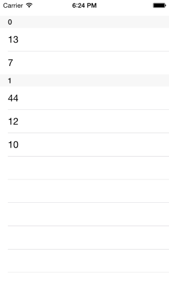

# DataSource: Getting Started

This quick start tutorial demonstrates how to create a simple iOS application with <code>TKDataSource</code>.


## Setting up TKDataSource

Now that our project is created and the TelerikUI.framework is added, we can start referencing and using the TelerikUI types:

Open your **ViewController.m** file and add a reference to the chart header file:

    #import <TelerikUI/TelerikUI.h>

Note that starting with Xcode 6 Apple doesn't generate the precompiled headers file automatically. That is why you should add import the UIKit framework before importing TelerikUI:

    #import <UIKit/UIKit.h>

If you are writing Swift, add the same line in your bridging header.

If you are using Xamarin, add a reference to TelerikUI.dll in your project and use the <code>using</code> directive:

    using TelerikUI;
    
The simplest way to use <code>TKDataSource</code> is to initialize it with an array. The following code creates a new instance of <code>TKDataSource</code> and loads it with a numeric array:

<snippet id='datasource-getting-started'/>

<snippet id='datasource-getting-started-swift'/>

```C#
dataSource = new TKDataSource (ArrayWithObjects(new object [] { 10, 5, 12, 7, 44 }), null);
```

<br>
<code>TKDataSource</code> supports a full range of data shaping operations including filtering, sorting and grouping. In the code snippet below, we first filter the numbers smaller than 5, then sort the rest, group the sorted values depending on whether they are even or odd, multiply every value by 10 and finally find the max value:

<snippet id='datasource-data-shaping'/>

<snippet id='datasource-data-shaping-swift'/>

```C#
// filter all values less or equal to 5
dataSource.Filter ((NSObject item) => {
    return ((NSNumber)item).NIntValue > 5;
});

// sort ascending
dataSource.Sort ((NSObject obj1, NSObject obj2) => {
    nint a = ((NSNumber)obj1).NIntValue;
    nint b = ((NSNumber)obj2).NIntValue;
    if (a<b) return NSComparisonResult.Descending; 
    else if (a>b) return NSComparisonResult.Ascending;
    return NSComparisonResult.Same;
});

// group odd/even values
dataSource.Group ((NSObject item) => {
    return NSObject.FromObject(((NSNumber)item).NIntValue % 2 == 0);
});

// multiply every value * 10
dataSource.Map ((NSObject item) => {
    return NSObject.FromObject(((NSNumber)item).NIntValue * 10);
});

// find the max value
NSObject maxValue = dataSource.Reduce (NSObject.FromObject(0), (NSObject item, NSObject value) => {
    if (((NSNumber)item).NIntValue > ((NSNumber)value).NIntValue) 
        return item;
    return value;
});
```

<br>
<code>TKDataSource</code> is an independent component and you can use it without connecting it to a UI control. To show the result just iterate the items:

<snippet id='datasource-print'/>

<snippet id='datasource-print-swift'/>

```C#
// output everything to the console
dataSource.Enumerate ((NSObject item) => {
    if (item.IsKindOfClass(new ObjCRuntime.Class(typeof(TKDataSourceGroup)))) {
        TKDataSourceGroup group = (TKDataSourceGroup)item;
        Console.WriteLine("group: {0}", group.Key);
    }
    else {
        Console.WriteLine("{0}", ((NSNumber)item).NIntValue);
    }
});
```

<br>
Or, you can create a table view and set its data source property:

<snippet id='datasource-tableview'/>

<snippet id='datasource-tableview-swift'/>

```C#
// bind with a table view
var tableView = new UITableView (this.View.Bounds);
tableView.DataSource = dataSource;
this.View.AddSubview (tableView);
```

Note that the <code>dataSource</code> property of <code>UITableView</code> is weak and you should assign the <code>dataSource</code> instance to a class variable in order to persist its value!

<br>
Here is the full code of this example:



<snippet id='datasource-gettingstarted-full'/>

<snippet id='datasource-gettingstarted-full-swift'/>

```C#
[Register("DataSourceGettingStarted")]
public class DataSourceGettingStarted: XamarinExampleViewController
{
    TKDataSource dataSource;

    public override void ViewDidLoad ()
    {
        base.ViewDidLoad ();

        dataSource = new TKDataSource (ArrayWithObjects(new object [] { 10, 5, 12, 7, 44 }), null);

        // filter all values less or equal to 5
        dataSource.Filter ((NSObject item) => {
            return ((NSNumber)item).NIntValue > 5;
        });

        // sort ascending
        dataSource.Sort ((NSObject obj1, NSObject obj2) => {
            nint a = ((NSNumber)obj1).NIntValue;
            nint b = ((NSNumber)obj2).NIntValue;
            if (a<b) return NSComparisonResult.Descending; 
            else if (a>b) return NSComparisonResult.Ascending;
            return NSComparisonResult.Same;
        });

        // group odd/even values
        dataSource.Group ((NSObject item) => {
            return NSObject.FromObject(((NSNumber)item).NIntValue % 2 == 0);
        });

        // multiply every value * 10
        dataSource.Map ((NSObject item) => {
            return NSObject.FromObject(((NSNumber)item).NIntValue * 10);
        });

        // find the max value
        NSObject maxValue = dataSource.Reduce (NSObject.FromObject(0), (NSObject item, NSObject value) => {
            if (((NSNumber)item).NIntValue > ((NSNumber)value).NIntValue) 
                return item;
            return value;
        });

        Console.WriteLine ("the max value is: {0}", ((NSNumber)maxValue).NIntValue);

        // output everything to the console
        dataSource.Enumerate ((NSObject item) => {
            if (item.IsKindOfClass(new ObjCRuntime.Class(typeof(TKDataSourceGroup)))) {
                TKDataSourceGroup group = (TKDataSourceGroup)item;
                Console.WriteLine("group: {0}", group.Key);
            }
            else {
                Console.WriteLine("{0}", ((NSNumber)item).NIntValue);
            }
        });

        // bind with a table view
        var tableView = new UITableView (this.View.Bounds);
        tableView.DataSource = dataSource;
        this.View.AddSubview (tableView);

    }

    NSObject[] ArrayWithObjects(object[] objects)
    {
        List<NSObject> array = new List<NSObject>();
        for (int i = 0; i<objects.Length; i++) {
            array.Add (NSObject.FromObject (objects [i]));
        }
        return array.ToArray();
    }
}
```

<br>
You can easily switch the UI control used to present data coming from <code>TKDataSource</code>. It supports the most common data enabled UI controls, so you can use it the same way with <code>UICollectionView</code>, <code>TKChart</code>, <code>TKListView</code>, or <code>TKCalendar</code>. The following article demonstates how to initialize and customize the UI controls supported by <code>TKDataSource</code>:
[Binding with UI controls](binding-with-ui)

<code>TKDataSource</code> supports also different data inputs. This article demonstrates how to load data comming from files or a web service.
[Loading with data](populating-with-data)

Data shaping operations are described in detail in this article:
[Data shaping operations](data-shaping)
