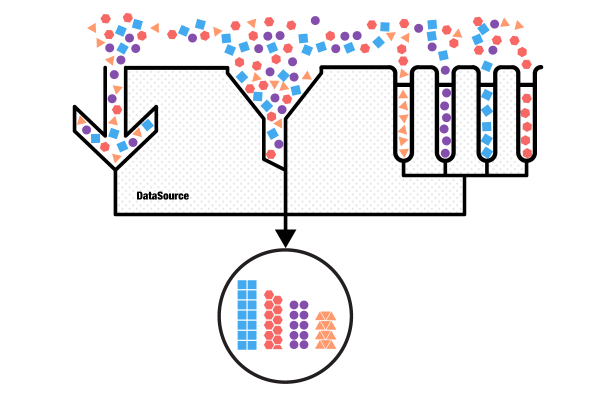

# TKDataSource: Overview

TKDataSource is a non-visual component that consumes data from various sources. It supports data shaping operations like sorting, filterign and grouping. It adopts the most used data enabled UI controls in iOS: UITableView and UICollectionView to automate the presentation of its data. TKDataSource works perfecltly with TKListView, TKChart and TKCalendar too.

**Consuming data**

TKDataSource can consume various data types: simple arrays, arrays with business objects and dictionaries coming from various sources. Its easy to use API allows loading data from files and web services. 

**Data shaping operations**

TKDataSource supports the following data shaping operations:

- sorting
- filtering
- grouping

For your convenience TKDataSource provides three differnet APIs for data shaping operations.

**Presenting data**

TKDataSource can present data by using the following UI controls:

- TKListView
- TKChart
- TKCalendar
- UITableView
- UICollectionView

You can use TKDataSource to present the same data in different UI controls at the same time. In this scenario TKDataSource syncs the current item in the presented controls.
