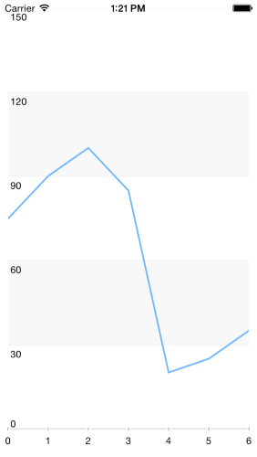

# DataSource: Populating with Data

TKDataSource can consume data coming from various sources. 



The simplest way to load data in <code>TKDataSource</code> is to use an array with numbers or strings:

<snippet id='datasource-getting-started'/>

<snippet id='datasource-getting-started-swift'/>

```C#
dataSource = new TKDataSource (ArrayWithObjects(new object [] { 10, 5, 12, 7, 44 }), null);
```

It also supports arrays of business objects. In this scenario you can use <code>displayKey</code> and <code>valueKey</code> properties to define how to present the data:

<snippet id='datasource-feed-object'/>

<snippet id='datasource-feed-object-swift'/>

```C#
var array = new NSMutableArray ();
array.Add (new DSItem () { Name = "John", Value = 22.0f, Group = "one" });
array.Add (new DSItem () { Name = "Peter", Value = 15.0f, Group = "one" });
array.Add (new DSItem () { Name = "Abby", Value = 47.0f, Group = "one" });
array.Add (new DSItem () { Name = "Robert", Value = 45.0f, Group = "two" });
array.Add (new DSItem () { Name = "Alan", Value = 17.0f, Group = "two" });
array.Add (new DSItem () { Name = "Saly", Value = 33.0f, Group = "two" });

dataSource.DisplayKey = "Name";
dataSource.ValueKey = "Value";
dataSource.ItemSource = array;
```


If a greater precision is necessary, you can implement the <code>formatText</code> block to define how the data will be presented:

<snippet id='datasource-text'/>

<snippet id='datasource-text-swift'/>

```C#
dataSource.FormatText ((NSObject item, TKDataSourceGroup group) => {
    DSItem dsItem = (DSItem)item;
    return new NSString(string.Format("{0} has {1} points", dsItem.Name, dsItem.Value));
});
```

When using <code>NSDictionary</code> as a data provider for TKDataSource, its <code>items</code> property contains the keys collection of the dictionary and the <code>itemSource</code> property contains the dictionary itself. The following code manipulates the dictionary by applying sorting and filtering methods and then presents the data:

<snippet id='datasource-dict'/>

<snippet id='datasource-dict-swift'/>

```C#
NSMutableDictionary dict = new NSMutableDictionary();
dict.Add (new NSString ("John"), NSObject.FromObject (50));
dict.Add (new NSString ("Abby"), NSObject.FromObject (33));
dict.Add (new NSString ("Smith"), NSObject.FromObject (42));
dict.Add (new NSString ("Peter"), NSObject.FromObject (28));
dict.Add (new NSString ("Paula"), NSObject.FromObject (25));

TKDataSource dataSource = new TKDataSource ();
dataSource.ItemSource = dict;
dataSource.SortWithKey ("", true);
dataSource.Filter ((NSObject item) => {
    return ((NSNumber)dict.ObjectForKey(item)).Int32Value > 30;
});
```

<code>TKDataSource</code> is handy when loading data from resources. With a simple method call it loads a JSON formatted file, parses its data and is ready to present or shape the data:

<snippet id='datasource-file'/>

<snippet id='datasource-file-swift'/>

```C#
this.Photos = new TKDataSource ("PhotosWithNames", "json", "photos");
```

It can load also data coming from a web service. The following code downloads a JSON formatted data from a web service, groups its items and presents the result in TKChart:

<snippet id='remote-data'/>

<snippet id='remote-data-swift'/>

```C#
var chart = new TKChart (this.View.Bounds);
chart.AutoresizingMask = UIViewAutoresizing.FlexibleWidth | UIViewAutoresizing.FlexibleHeight;
this.View.Add (chart);
        
string url = "http://www.telerik.com/docs/default-source/ui-for-ios/weather.json?sfvrsn=2";
dataSource.LoadDataFromURL (url, TKDataSourceDataFormat.JSON, "dayList", (NSError err) => {
    if (err != null) {
        Console.WriteLine("Can't connect with the server!");
        return;
    }

    dataSource.Settings.Chart.CreateSeries((TKDataSourceGroup group) => {
        TKChartSeries series = null;
        if (group.ValueKey == "clouds") {
            series = new TKChartColumnSeries();
            series.YAxis = new TKChartNumericAxis(NSObject.FromObject(0), NSObject.FromObject(100));
            series.YAxis.Title = "clouds";
            series.YAxis.Style.TitleStyle.RotationAngle = (float)Math.PI/2.0f;
        }
        else {
            series = new TKChartLineSeries();
            series.YAxis = new TKChartNumericAxis(NSObject.FromObject(-10), NSObject.FromObject(30));
            if (group.ValueKey == "temp.min") {
                series.YAxis.Position = TKChartAxisPosition.Right;
                series.YAxis.Title = "temperature";
                series.YAxis.Style.TitleStyle.RotationAngle = (float)Math.PI/2.0f;
                chart.AddAxis(series.YAxis);
            }
        }
        return series;
    });

    dataSource.Map((NSObject item) => {
        double interval = ((NSNumber)item.ValueForKey(new NSString("dateTime"))).DoubleValue;
        NSDate date = NSDate.FromTimeIntervalSince1970(interval);
        item.SetValueForKey(date, new NSString("dateTime"));
        return item;
    });

    NSObject[] items = this.dataSource.Items;
    NSMutableArray newItems = new NSMutableArray();
    newItems.Add(new TKDataSourceGroup(items, "clouds", "dateTime"));
    newItems.Add(new TKDataSourceGroup(items, "temp.min", "dateTime"));
    newItems.Add(new TKDataSourceGroup(items, "temp.max", "dateTime"));
    dataSource.ItemSource = newItems;

    chart.DataSource = dataSource;

    var formatter = new NSDateFormatter();
    formatter.DateFormat = "dd";
    TKChartDateTimeAxis xAxis = (TKChartDateTimeAxis)chart.XAxis;
    xAxis.MajorTickInterval = 1;
    xAxis.PlotMode = TKChartAxisPlotMode.BetweenTicks;
    xAxis.LabelFormatter = formatter;
    xAxis.Title = "date";
    xAxis.MinorTickIntervalUnit = TKChartDateTimeAxisIntervalUnit.Days;
});
```