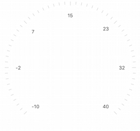
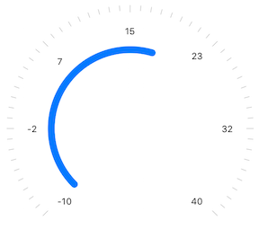
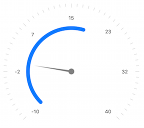

# Gauges for Xamarin.iOS: Getting Started

This quick start tutorial demonstrates how to create a simple gauge view with <code>TKGauge</code>.

## Setting up the TKGauge

In order to use the Telerik UI for Xamarin.iOS Gauge control you need to add the following namespace: 

Open your **UIViewController* file and add a reference to the chart header file:

```C#
using TelerikUI;
```

Note that starting with Xcode 6 Apple doesn't generate the precompiled headers file automatically. That is why you should add import the UIKit framework before importing TelerikUI:

```C#
using UIKit;
```

## Add Radial Gauge

You can start by creating a <code>TKGauge</code> view object in <code>ViewDidLoad()</code> method. TelerikUI supports radial and linear type of gauge. You can instantiate TKRadialGauge by using the following lines:

```C#
radialGauge = new TKRadialGauge ();
this.radialGauge.Delegate = new GaugeDelegate ();
this.View.AddSubview (this.radialGauge);
```

There is few tipes of components - scales, segments and indicators - allowing you to fully customize the overall look and feel.

## Add Scale

Here is an example how to add scale:

```C#
TKGaugeRadialScale scale = new TKGaugeRadialScale (new NSNumber (0), new NSNumber (6));
this.radialGauge.AddScale (scale);
```



## Add Segment

Now add a segment to the scale:

```C#
TKGaugeSegment segment = new TKGaugeSegment (new NSNumber(-10), new NSNumber(18));
segment.Location = 0.56f;
segment.Width = 0.05f;
segment.Width2 = 0.05f;
segment.Cap = TKGaugeSegmentCap.Round;
```



## Add Indicator

Add an indicator to the scale:

```C#
TKGaugeNeedle needle = new TKGaugeNeedle();
needle.Width = 3;
needle.TopWidth = 3;
needle.Length = 0.6f;
needle.ShadowOffset = new CGSize(1, 1);
needle.ShadowOpacity = 0.8f;
needle.ShadowRadius = 1.5f;
scale.AddIndicator(needle);
```
		


> Gauge Getting Started example can be found in our [Native Xamarin.iOS examples](#native-only-examples).
