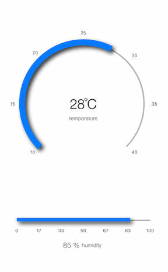
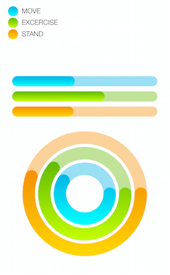

# Gauges: Overview

TKGauge is a highly customizable component that allows you to show the current status of a value within a range of upper and lower bounds, illustrate progress towards a goal or a summary of a fluctuating metric.  <table>
<tr>
<td>
</td><td></td>
</tr>
</table>

TKGauge main features include:

- Various components types: indicators, segments, ranges, scales
- Multiple scales with different ranges
- Multiple indicators
- Value animations
- User interactions
