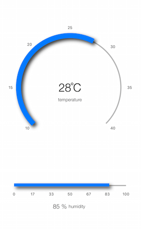

# Gauges for Xamarin.iOS: Overview

The **TKGauge** control serve as instrument that indicate and give a visual display of amount, level, or contents of something. These values are presented via indicators (needles, arrows, and others). In addition TKGauge is a highly customizable component that allows you to show the current status of a value within a range of upper and lower bounds, illustrate progress towards a goal or a summary of a fluctuating metric.

<table>
<tr>
<td></td>
<td></td>
</tr>
</table>

TKGauge main features include:

- **Different display layouts**: `RadialGauge` and `LinearGauge`

- **Various components types**: `indicators`, `segments`, `ranges`, `scales`

- **Multiple scales with different ranges**

- **Multiple indicators**

- **Animations**

- **User interactions**

> Examples with Gauge control can be found in our [Native Xamarin.iOS examples](#native-only-examples).
