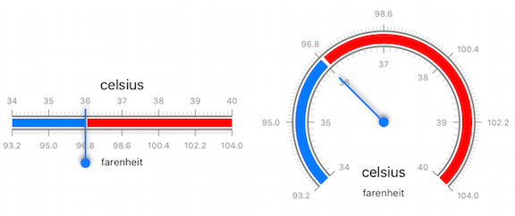

# Gauges for Xamarin.iOS: Scales

**TKGauge** component TKGaugeScale provides two types of visual representation:



## Radial

```C#
TKGaugeRadialScale scale1 = new TKGaugeRadialScale ();
scale1.Range = new TKRange (new NSNumber(34), new NSNumber(40));
scale1.Ticks.Position = TKGaugeTicksPosition.Inner;
this.radialGauge.AddScale(scale1);
```

* Blue Segment 

```C#
TKGaugeSegment blueSegment = new TKGaugeSegment ();
blueSegment.Range = new TKRange (new NSNumber(34), new NSNumber(36));
blueSegment.Location = 0.70f;
blueSegment.Width = 0.08f;
scale1.AddSegment(blueSegment);
```

* Red Segment
			
```C#
TKGaugeSegment redSegment = new TKGaugeSegment();
redSegment.Range = new TKRange (new NSNumber(36.05), new NSNumber(40));
redSegment.Location = 0.70f;
redSegment.Width = 0.08f;
redSegment.Fill = new TKSolidFill(UIColor.Red);
scale1.AddSegment(redSegment);
```

* Additional customizations for ticks and label: 

```C#
TKGaugeRadialScale scale2 = new TKGaugeRadialScale ();
scale2.Range = new TKRange (new NSNumber(93.2), new NSNumber(104));
scale2.Ticks.Position = TKGaugeTicksPosition.Outer;
scale2.Ticks.MajorTicksCount = 6;
scale2.Ticks.MinorTicksCount = 20;
scale2.Labels.Offset = 0.15f;
scale2.Labels.Position = TKGaugeLabelsPosition.Outer;
scale2.Labels.LabelFormat = "%.01f";
scale2.Labels.Count = 6;
this.radialGauge.AddScale(scale2);

for(int i = 0; i< this.radialGauge.Scales.Length; i++) {
	TKGaugeRadialScale scale = this.radialGauge.Scales[i] as TKGaugeRadialScale;
	scale.Stroke = new TKStroke(UIColor.Gray, 2);
	scale.Ticks.MajorTicksStroke = new TKStroke(UIColor.Gray, 1);
	scale.Labels.Color = UIColor.Gray;
	scale.Ticks.Offset = 0;
	scale.Radius = i*0.12f + 0.60f;
}
```

## Linear

```C#
TKGaugeLinearScale scale1 = new TKGaugeLinearScale ();
scale1.Range = new TKRange (new NSNumber(34), new NSNumber(40));
scale1.Ticks.Position = TKGaugeTicksPosition.Inner;
this.linearGauge.AddScale(scale1);
```

The scales appereance can be easily customized by adding different segments to it. 

* Red Segment

```C#
TKGaugeSegment blueSegment = new TKGaugeSegment ();
blueSegment.Range = new TKRange (new NSNumber(34), new NSNumber(36));
blueSegment.Location = 0.62f;
blueSegment.Width = 0.08f;
blueSegment.Width2 = 0.08f;
scale1.AddSegment(blueSegment);
```

* Blue Segment

```C#
TKGaugeSegment redSegment = new TKGaugeSegment();
redSegment.Range = new TKRange (new NSNumber(36.05), new NSNumber(40));
redSegment.Location = 0.62f;
redSegment.Width = 0.08f;
redSegment.Width2 = 0.08f;
redSegment.Fill = new TKSolidFill(UIColor.Red);
scale1.AddSegment(redSegment);
```

<code>TKGauge</code> also allows applying multiple scales on a single gauge.

<code>TKGaugeScale</code> has various properties for customizing its ticks and labels. 

So, let's add a second scale and customize both:

```C#
TKGaugeLinearScale scale2 = new TKGaugeLinearScale ();
scale2.Range = new TKRange (new NSNumber(93.2), new NSNumber(104));
scale2.Ticks.Position = TKGaugeTicksPosition.Outer;
scale2.Ticks.MajorTicksCount = 6;
scale2.Ticks.MinorTicksCount = 20;
scale2.Labels.Position = TKGaugeLabelsPosition.Outer;
scale2.Labels.LabelFormat = "%.01f";
scale2.Labels.Count = 6;
this.linearGauge.AddScale(scale2);

for(int i = 0; i< this.linearGauge.Scales.Length; i++) {
                
    TKGaugeLinearScale scale = this.linearGauge.Scales[i] as TKGaugeLinearScale;
    scale.Stroke = new TKStroke(UIColor.Gray, 2);
    scale.Ticks.MajorTicksStroke = new TKStroke(UIColor.Gray, 1);
    scale.Labels.Color = UIColor.Gray;
    scale.Ticks.Offset = 0;
    scale.Offset = i*0.12f + 0.60f;
}
```

## Example

> Sample Gauges Scale example with Linear and Radial Gauge can be found in our [Native Xamarin.iOS examples](#native-only-examples).


