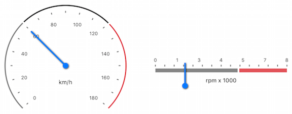

# Gauges for Xamarin.iOS: Segments

**TKGauge Segment** is a class representing a color range indicating a portion of the gauge with different width, radius, start and end value. 

<table>
<tr> </tr>
<tr></tr>
</table>

You can use the following properties when applying a Segment:

* `Location` property of <code>TKGaugeSegment</code> determines how far from the center the segment will be placed. Its value could be between 0 and 1.

* The width of a segment is controlled by the <code>Width</code> property which can also be between 0 and 1.

* The segment has properties as <code>Fill</code> and <code>Stroke</code> that are used for customizing the look of the segment. 

* `Cap` property (of type *TelerikUI.TKGaugeSegmentCap*) determines if the ends of the segment are **rounded** or **edgy**.

```C#
TKGaugeSegment segment = new TKGaugeSegment (this.greenValues[i], this.greenValues[i+1]);
segment.Fill = new TKSolidFill(this.greenColors[i]);
segment.Location = 0.67f;
segment.Cap = TKGaugeSegmentCap.Round;
```

> Sample example Segments can be found in our [Native Xamarin.iOS examples](#native-only-examples) Gauge Ranges demo.
