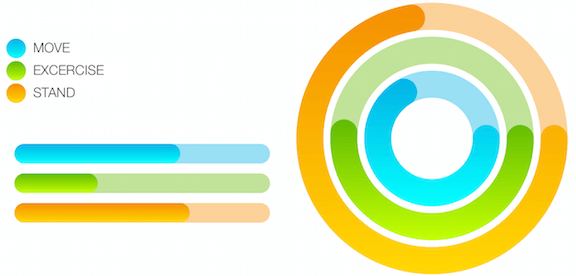

# Gauges: Segments

TKGauge segment is a class representing a color range indicating a portion of the gauge with different width, radius, start and end value. 

<table>
<tr> </tr>
<tr></tr>
</table>

Let's take a look over the segments added to a radial gauge:
The <code>location</code> property of <code>TKGaugeSegment</code> determines how far from the center the segment will be placed. Its value could be between 0 and 1.

The width of a segment is controlled by the <code>width</code> property which can also be between 0 and 1.

<snipppet id='gauge-segments'/>

<snipppet id='gauge-segments-swift'/>

<snipppet id='gauge-segments-cs'/>

The segment has properties as <code>fill</code> and <code>stroke</code> that are used for customizing the look of the segment. And the <code>cap</code> property determines if the ends of the segment are rounded or edgy.

<snippet id='gauge-customize'/>

<snippet id='gauge-customize-swift'/>

```C#
this.colors = new UIColor[] { 
    new UIColor (0.00f, 0.70f, 0.90f ,1.00f),
    new UIColor (0.38f, 0.73f, 0.00f, 1.00f),
    new UIColor (0.96f, 0.56f, 0.00f, 1.00f),
    new UIColor (0.00f, 1.00f, 1.00f, 1.00f),
    new UIColor (0.77f, 1.00f, 0.00f, 1.00f),
    new UIColor (1.00f, 0.85f, 0.00f, 1.00f)
};
```

