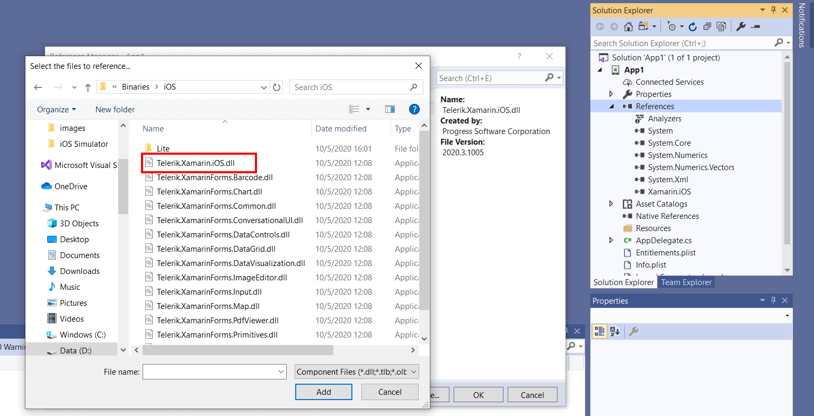

## Telerik UI for Xamarin.iOS: Getting Started

This article explains how to start using **Telerik UI for Xamarin.iOS** controls inside a Xamarin.iOS application.

### System Requirements

To build for Xamarin.iOS, the following are required:

 - the latest version of Visual Studio or Visual Studio for Mac
 - the latest iOS SDK
 - the latest version of Xcode 
 - the minimum version of macOS required by Xcode
 
For specific version requirements, refer to the [latest Xamarin.iOS release notes](https://docs.microsoft.com/en-us/xamarin/ios/release-notes/).

### Reference the Telerik.Xamarin.iOS library from your project

In order to use any of our Xamarin.iOS controls inside your Xamarin.iOS application, you would need to add a reference to the **Telerik.Xamarin.iOS.dll** assembly.

>tip Check [Download Product Files]() topic for detailed instructions on how to navigate to Telerik UI for Xamarin download page. Download "Telerik_UI_for_Xamarin_[version]_[license].zip" file which contains the needed assembly for Xamarin.iOS development (named Telerik.Xamarin.iOS.dll) inside Binaries/iOS folder.

1. Click on **iOS App (Xamarin)** project template in Visual Studio/Visual Studio for Mac to create a new Xamarin.iOS solution:

2. Go through the next steps to configure the solution location, minimum iOS version, etc.

3. Add a reference to the Telerik.Xamarin.iOS.dll library by right-clicking the **References** of your project and selecting **Edit References...**.

4. Your solution is now ready to use Telerik UI for Xamarin.iOS.

## Opening the Examples solution

Examples solution that shows how to use the controls when developing through **Xamarin.iOS** is included in the Telerik UI for Xamarin zip file provided for manual installation. 

Telerik_UI_for_Xamarin_[version]_[license].zip, where [version] marks the release and [license] is replaced with Dev license, is available for download from the [Downloads section of your Telerik account](https://www.telerik.com/account/product-download?product=UIXAM). Unzip the archive and go to Examples folder - Xamarin.iOS solution is available in the iOS folder.

In addition, the Examples solution is included as part of the [Telerik UI for Xamarin MSI installation](). You can find it in the  "[installation-path]/Telerik UI for Xamarin [version]/Examples" folder. 