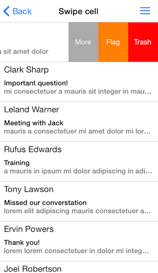

# ListView for Xamarin.iOS: Cell Swipe Gesture


The swipe gesture feature allows end-users to use swipe the ListView cell. When the user swipes, the content view moves revealing a designated swipe background view where you can place custom views ready for interaction e.g. buttons images etc.



## Enable Cell Swipe Gesture

Use the <code>AllowsCellSwipe</code> property to allow the user to perform swipe gesture on cells.

```C#
this.listView.AllowsCellSwipe = true;
```

## Configure Cell Swipe Gesture

Use the <code>CellSwipeLimits</code> property to set how far the cell may be swiped.

```C#
this.listView.CellSwipeLimits = new UIEdgeInsets (0, 60, 0, 180);
```

Use the <code>CellSwipeTreshold</code> property to set the minimum distance the user needs to swipe before the gesture is considered effective. If the user swipes below the treshold, the cell will auto-revert to its original state.

```C#
this.listView.CellSwipeTreshold = 30;
```

Use the <code>CellSwipeAnimationDuration</code> property to set the cell swipe animation duration 

Add the content that should be visible when swipe is applied to the backgroundView of TKListViewCell:

```C#
if (cell.SwipeBackgroundView.Subviews.Length == 0) {
    CGSize size = cell.Frame.Size;
    UIFont font = UIFont.SystemFontOfSize(14);
    UIButton bMore = new UIButton(new CGRect(size.Width - 180, 0, 60, size.Height));
    bMore.SetTitle("More", UIControlState.Normal);
    bMore.BackgroundColor = UIColor.LightGray;
    bMore.TitleLabel.Font = font;
    bMore.AddTarget(ButtonTouched, UIControlEvent.TouchUpInside);
    cell.SwipeBackgroundView.AddSubview(bMore);

    UIButton bFlag = new UIButton(new CGRect(size.Width - 120, 0, 60, size.Height));
    bFlag.SetTitle("Flag", UIControlState.Normal);
    bFlag.BackgroundColor = UIColor.Orange;
    bFlag.TitleLabel.Font = font;
    bFlag.AddTarget(ButtonTouched, UIControlEvent.TouchUpInside);
    cell.SwipeBackgroundView.AddSubview(bFlag);

    UIButton bTrash = new UIButton(new CGRect(size.Width - 60, 0, 60, size.Height));
    bTrash.SetTitle("Trash", UIControlState.Normal);
    bTrash.BackgroundColor = UIColor.Red;
    bTrash.TitleLabel.Font = font;
    bTrash.AddTarget(ButtonTouched, UIControlEvent.TouchUpInside);
    cell.SwipeBackgroundView.AddSubview(bTrash);

    UIButton bUnread = new UIButton(new CGRect(0, 0, 60, size.Height));
    bUnread.SetTitle("Mark as Unread", UIControlState.Normal);
    bUnread.BackgroundColor = UIColor.Blue;
    bUnread.TitleLabel.Font = font;
    bUnread.TitleLabel.LineBreakMode = UILineBreakMode.WordWrap;
    bUnread.TitleLabel.TextAlignment = UITextAlignment.Center;
    bUnread.AddTarget(ButtonTouched, UIControlEvent.TouchUpInside);
    cell.SwipeBackgroundView.AddSubview(bUnread);
}
```

## Responding to swipe interactions

In order to respond programmatically to a swipe gesture performed by user, you will need to implement one or more of the following methods from the TKListViewDelegate protocol.

- ShouldSwipeCell

- DidSwipeCell

- DidFinishSwipeCell

```C#
class ListViewDelegate: TKListViewDelegate 
{
    ListViewSwipe owner;

    public ListViewDelegate(ListViewSwipe owner) 
    {
        this.owner = owner;
    }

    public override void DidSwipeCell (TKListView listView, TKListViewCell cell, NSIndexPath indexPath, CGPoint offset)
    {
        this.owner.AnimateButtonInCell (cell, offset);
    }

    public override void DidFinishSwipeCell (TKListView listView, TKListViewCell cell, NSIndexPath indexPath, CGPoint offset)
    {
        Console.WriteLine ("Did swipe cell at index: {0}", indexPath.Row);
    }
}
```

> A sample ListView Cell Swipe example can be found in our [Native Xamarin.iOS examples](#native-only-examples).
