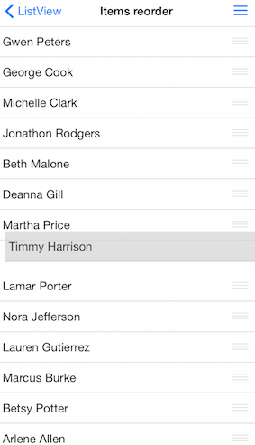

# ListView: Reordering Cells

TKListView supports reordering cells. When reordering is enabled a drag handle appears in each cell. Using this handle cells can be dragged thus changing the order of items.


## Enable cell reorder ##
Use the <code>allowsCellReorder</code> property to enable user to reorder cells. When reordering is allowed cells will display a draggable reorder handle as a visual hint.

<snippet id='listview-reorder'/>

<snippet id='listview-reorder-swift'/>

```C#
this.listView.AllowsCellReorder = true;
```

## Responding to cell reorder interaction ##

After the user performs a reorder gesture the following delegate method from the TKListViewDelegate protocol will be called - listView:didReorderItemFromIndexPath:toIndexPath:

This is the place where you get information about which item was reordered and from what position and to what position. There you need to reorder your source data. 

<snippet id='listview-did-reorder'/>

<snippet id='listview-did-reorder-swift'/>

```C#
public override void DidReorderItemFromIndexPath (TKListView listView, NSIndexPath originalIndexPath, NSIndexPath targetIndexPath)
{
    TKListViewCell cell = listView.CellForItem(originalIndexPath);
    cell.BackgroundView.BackgroundColor = UIColor.White;
    this.owner.dataSource.DidReorderItemFromTo (listView, originalIndexPath, targetIndexPath);
}
```

*In case you are using TKDataSource you may set it as a delegate for TKListView. With such a setup you will not need to reorder your data manually. TKDataSource will handle that for you.

<snippet id='listview-datasource-reorder'/>

<snippet id='listview-datasource-reorder-swift'/>

```C#
this.listView.WeakDataSource = this.dataSource;
this.dataSource.AllowItemsReorder = true;
```

