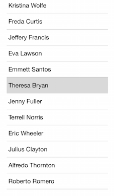
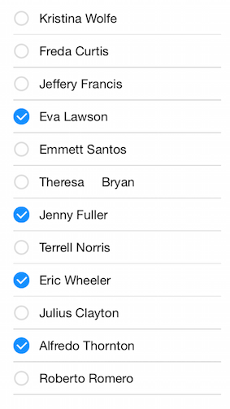
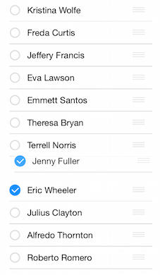

# ListView: Getting Started

This quick start tutorial demonstrates how to create a simple iOS application with <code>TKListView</code>.

## Setting up TKListView

Now that our project is created and the TelerikUI.framework is added, we can start referencing and using the TelerikUI types:

Open your <code>ViewController.m</code> file and add a reference to Telerik UI header file:

    #import <TelerikUI/TelerikUI.h>

Note that starting with Xcode 6 Apple doesn't generate the precompiled headers file automatically. That is why you should add import the UIKit framework before importing TelerikUI:

    #import <UIKit/UIKit.h>

If you are writing Swift, add the same line in your bridging header.

In the <code>viewDidLoad</code> method of your view controller prepare a small array of sample data to be presented in <code>TKListView</code>. 

<snippet id='listview-feed'/>
<snippet id='listview-feed-swift'/>
```C#
simpleArrayOfStrings = new NSMutableArray();
simpleArrayOfStrings.Add (new NSString ("Kristina Wolfe"));
simpleArrayOfStrings.Add (new NSString ("Freda Curtis"));
simpleArrayOfStrings.Add (new NSString ("Eva Lawson"));
simpleArrayOfStrings.Add (new NSString ("Emmett Santos"));
simpleArrayOfStrings.Add (new NSString ("Theresa Bryan"));
simpleArrayOfStrings.Add (new NSString ("Jenny Fuller"));
simpleArrayOfStrings.Add (new NSString ("Terrell Norris"));
simpleArrayOfStrings.Add (new NSString ("Eric Wheeler"));
simpleArrayOfStrings.Add (new NSString ("Julius Clayton"));
simpleArrayOfStrings.Add (new NSString ("Harry Douglas"));
simpleArrayOfStrings.Add (new NSString ("Eduardo Thomas"));
simpleArrayOfStrings.Add (new NSString ("Orlando Mathis"));
simpleArrayOfStrings.Add (new NSString ("Alfredo Thornton"));
```

Next, create an instance of [<code>TKDataSource<code>](../datasource/getting-started). This components is used to feed our data to <code>TKListView</code>. 

<snippet id='listview-feed-ds'/>
<snippet id='listview-feed-ds-swift'/>
```C#
dataSource.ItemSource = simpleArrayOfStrings;
```

Then create a new instance of <code>TKListView</code> and add it as a subview of the ViewController's main view. The <code>autoresizingMask</code> property is set in order to allow correct resizing of the list view when the device is rotated in landscape mode. 

<snippet id='listview-init'/>
<snippet id='listview-init-swift'/>
```C#
TKListView listView = new TKListView ();
listView.Frame = new CGRect (0, 0, this.View.Bounds.Size.Width,this.View.Bounds.Size.Height-20);
listView.AutoresizingMask = UIViewAutoresizing.FlexibleWidth | UIViewAutoresizing.FlexibleHeight;
listView.WeakDataSource = dataSource;
this.View.AddSubview(listView);
```

So far we have got the following view: 



Now lets enable multiple selection: 

<snippet id='listview-init-selec'/>
<snippet id='listview-init-selec-swift'/>
```C#
listView.AllowsMultipleSelection = true;
```

To see the result, after running this sample, select to select a few items:



Adding a single line of code should allow the user to reorder items by dragging a handle.

<snippet id='listview-init-reorder'/>
<snippet id='listview-init-reorder-swift'/>
```C#
listView.AllowsCellReorder = true;
```

