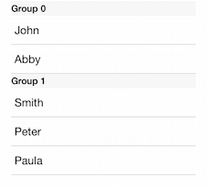

# ListView for Xamarin.iOS: Grouping 

ListView may be set up to display items in groups divided visually by section headers and footers.
There are two ways to implement grouping with TKListView - manually implementing the required methods of the TKListViewDataSource delegate or using TLKDataSource and let it do the dirty work for you.



## Displaying grouped data using TKDataSource

In case you need more flexibility you may implement grouping manualy as follows.

```C#
NSMutableArray items = new NSMutableArray ();
items.Add (new DataSourceItem ("John", 50f, "A"));
items.Add (new DataSourceItem ("Abby", 33f, "A"));
items.Add (new DataSourceItem ("Smith", 42f, "B"));
items.Add (new DataSourceItem ("Peter", 28f, "B"));
items.Add (new DataSourceItem ("Paula", 25f, "B"));

this.dataSource = new TLKDataSource ();
this.dataSource.ItemSource = items;
this.dataSource.GroupWithKey ("Group");
dataSource.DisplayKey = "Name";

TKListView listView = new TKListView (new CGRect (20, 20, this.View.Bounds.Size.Width - 40, this.View.Bounds.Size.Height - 40));
listView.WeakDataSource = dataSource;
this.View.AddSubview (listView);

var layout = listView.Layout as TKListViewLinearLayout;
layout.HeaderReferenceSize = new CGSize (200, 22);
```

## Displaying grouped data using a TKListViewDataSource delegate methods

Here is the code:

```C#
public class ListViewDocsGroupsDelegate : XamarinExampleViewController
{
    public NSMutableArray groups;

    public ListViewDocsGroupsDelegate ()
    {
    }

    public override void ViewDidLoad ()
    {
        base.ViewDidLoad ();
        groups = new NSMutableArray ();
        groups.Add (NSArray.FromStrings (new string[] { "John", "Abby" }));
        groups.Add(NSArray.FromStrings (new string[] { "Smith", "Peter", "Paula" }));

        TKListView listView = new TKListView (new CGRect (20, 20, this.View.Bounds.Size.Width - 40, this.View.Bounds.Size.Height - 40));
        listView.RegisterClassForCell (new Class (typeof(TKListViewCell)), "cell");

        listView.RegisterClassForSupplementaryView (new Class (typeof(TKListViewHeaderCell)), TKListViewElementKindSectionKey.Header, new NSString("header"));
        listView.DataSource = new ListViewDataSource (this);
        TKListViewLinearLayout layout = (TKListViewLinearLayout)listView.Layout;
        layout.HeaderReferenceSize = new CGSize (200, 22);

        this.View.AddSubview (listView);
    }
}

class ListViewDataSource : TKListViewDataSource
{
    ListViewDocsGroupsDelegate owner;

    public ListViewDataSource (ListViewDocsGroupsDelegate owner)
    {
        this.owner = owner;
    }

    public override int NumberOfSectionsInListView (TKListView listView)
    {
        return (int)this.owner.groups.Count;
    }

    public override int NumberOfItemsInSection (TKListView listView, int section)
    {
        return (int)this.owner.groups.GetItem<NSArray>((uint)section).Count;
    }

    public override TKListViewCell CellForItem (TKListView listView, NSIndexPath indexPath)
    {
        TKListViewCell cell = listView.DequeueReusableCell("cell", indexPath) as TKListViewCell;
        cell.TextLabel.Text = this.owner.groups.GetItem<NSArray> ((uint)indexPath.Section).GetItem<NSString> ((uint)indexPath.Row);
        return cell;
    }

    public override TKListViewReusableCell ViewForSupplementaryElementOfKind (TKListView listView, NSString kind, NSIndexPath indexPath)
    {
        TKListViewReusableCell headerCell = listView.DequeueReusableSupplementaryView(kind, "header", indexPath) as TKListViewReusableCell;
        headerCell.TextLabel.Text = String.Format ("Group {0}", indexPath.Section);
        return headerCell;
    }
}
```

> ListView Grouping example can be found in our [Native Xamarin.iOS examples](#native-only-examples).
