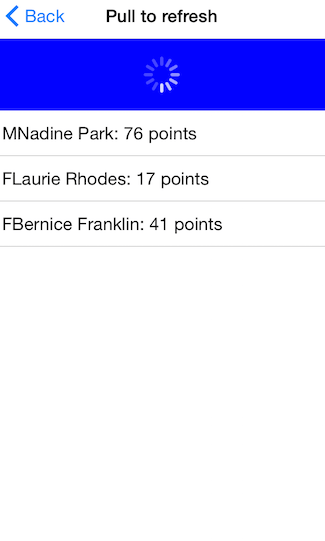

# ListView for Xamarin.iOS: Pull-to-refresh

TKListView can be refreshed by a pull-to-refresh gesture. If enabled, the feature allows the user to refresh data by swiping his finger down when the content is scrolled up to the top. This will trigger an animated activity indicator which will stay visible until data is refreshed.



## Enabling pull-to-refresh

Use the <code>AllowsPullToRefresh</code> property to enable the feature.

```C#
listView.AllowsPullToRefresh = true;
```

## Responding to the pull-to-refresh gesture

To be able to respond to the a pull-to-refresh gesture, you will need to implement the <code>ListViewShouldRefreshOnPull</code> method from the <code>TKListViewDelegate</code>protocol. After fresh data is available you will need to notify TKListView by calling the <code>didRefreshOnPull</code> method. This call will allow TKListView to hide the activity indicator and display the fresh data. 

```C#
public override bool ListViewShouldRefreshOnPull (TKListView listView)
{
    DispatchQueue.DefaultGlobalQueue.DispatchAsync (() => {
        Random r = new Random();
        this.owner.newItemsCount = this.owner.UpdateData(1 + r.Next(0, 4));
        DispatchQueue.MainQueue.DispatchAfter(new DispatchTime(DispatchTime.Now, 2 * 500000000), () => {
            listView.DidRefreshOnPull();
            if (this.owner.newItemsCount < 1) {
                UIAlertView alert = new UIAlertView("Pull to refresh", "No more data available!",null,"Close",null);
                alert.Show();
            }
        });
    });

    return true;
}
```

> ListView Pull to Refresh example can be found in our [Native Xamarin.iOS examples](##native-only-examples).