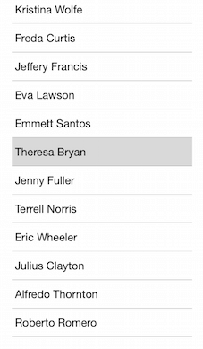
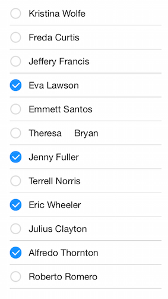

# ListView for Xamarin.iOS: Selection

TKListView supports different selection modes:

- Single selection
- Multiple selection

The end-user can use different gestures to trigger cell selection:

- Selection on press.
- Selection on hold (long press).

Additionaly, TKListView provides a few methods to programmatically control the selection state as well as delegate methods to react to user interactions related to selection.

This article describes the selection API of TKListView in detail.

The <code>AllowsMultipleSelection</code> property of <code>TKListView</code> defines whether the user is allowed to select multiple items at the same time. It also affects the default appearance of the selected items.

## Single seletion mode ##



The default value of the <code>AllowsMultipleSelection</code> property is <code>false</code> 

## Multiple selection mode##



Set the <code>allowsMultipleSelection</code> property to <code>true</code> to enable this view:

```C#
this.listView.AllowsMultipleSelection = true;
```

## Selection behavior##

The selectionBehavior property determines on what type of interaction cells get selected. It's values are 
By default TKListView will allow user to select on press.

```C#
this.listView.SelectionBehavior = TKListViewSelectionBehavior.Press;
```

## Selection on hold (long press)##

In this mode a long-press gesture is required in order to select a cell.

```C#
this.listView.SelectionBehavior = TKListViewSelectionBehavior.LongPress;
```

## Disable selection##

In order to disable the selection, you need to set the <code>SelectionBehavior</code> property to <code>TKListViewSelectionBehavior.None</code>:

```C#
this.listView.SelectionBehavior = TKListViewSelectionBehavior.None;
```

## Programatically selecting and deselecting items##

Cells can be selected programatically as well.

```C#
NSIndexPath indexPath = NSIndexPath.FromRowSection (1, 0);
this.listView.SelectItem (indexPath, false, UICollectionViewScrollPosition.None);
```

To deselected a cell programatically, you should call the <code>DeselectItem</code> method giving the indexPath of the cell.

## TKListViewDelegate methods

The <code>TKListViewDelegate</code> protocol provides a few handy delegate methods to be used to control and respond to selection events triggered by user. In order to take advantage of these methods, you should set the delegate proeprty of <code>TKListView</code> to a class adopting the <code>TKListViewDelegate</code> protocol. For example:

```C#
this.listViewDelegate = new ListViewDelegate(this);
```

Bellow you can find some details on how you can use the delegate methods from TKListViewDelegate.

## Responding to user triggered cell selection / deselection

If you need to perform a specific action after the user selects or deselects a cell, you can use the following methods from the TKListViewDelegate protocol:

<snippet id='listview-respond'/>

<snippet id='listview-respond-swift'/>

```C#
public override void DidSelectItemAtIndexPath (TKListView listView, NSIndexPath indexPath)
{
    this.owner.label.Text = string.Format("Selected: {0}", this.owner.dataSource.Items[indexPath.Row]);
    Console.WriteLine ("Did select item at row {0}", this.owner.dataSource.Items [indexPath.Row]);
    TKListViewCell cell = listView.CellForItem (indexPath);
    if (cell != null) {
        cell.SelectedBackgroundView.Hidden = false;
    }
}

public override void DidDeselectItemAtIndexPath (TKListView listView, NSIndexPath indexPath)
{
    Console.WriteLine("Did deselect item at row {0}", this.owner.dataSource.Items[indexPath.Row]);
}
```

> ListView Selection example can be found in our [Native Xamarin.iOS examples](##native-only-examples).