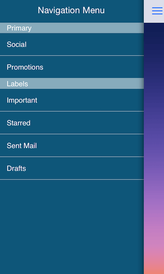

# TKSideDrawer: Customizations 



<code>TKSideDrawer</code> allows customizing almost every aspect of its visual appearance. This article demonstrates some of the customization techniques that can be used with it.

The most useful settings for changing the visual appearance of <code>TKSideDrawer</code> are grouped in its <code>style</code> property.

<snippet id='drawer-style'/>

<snippet id='drawer-style-swift'/>

```C#
sideDrawer.Style.HeaderHeight = 44;
sideDrawer.Style.ShadowMode = TKSideDrawerShadowMode.Hostview;
sideDrawer.Style.ShadowOffset = new CGSize (-2f, -0.5f);
sideDrawer.Style.ShadowRadius = 5;
```

Note that the default transition set to <code>TKSideDrawer</code> is SlideInOnTop whith blur enabled. If you prefer a solid color instead, you should set the <code>blurType</code> property to <code>TKSideDrawerBlurTypeNone</code> before setting the desired <code>fill</code>:

<snippet id='drawer-blur'/>

<snippet id='drawer-blur-swift'/>

```C#
sideDrawer.Fill = new TKSolidFill (UIColor.Gray);
sideDrawer.Style.BlurType = TKSideDrawerBlurType.None;
```

There are cases when you may need to update the styles of specific TKSideDrawer items like the text color. Or, you may need to show a separator. This can be done by adopting the <code>TKSideDrawerDelegate</code> protocol and implementing its <code>sideDrawer:updateVisualsForItem:inSection:</code> method.

<snippet id='drawer-update'/>

<snippet id='drawer-update-swift'/>

```C#
public override void UpdateVisualsForItem (TKSideDrawer sideDrawer, NSIndexPath indexPath)
{
    TKSideDrawerItem item = sideDrawer.Sections[indexPath.Section].Items[indexPath.Item];
    item.Style.ContentInsets = new UIEdgeInsets (0, -5, 0, 0);
    item.Style.SeparatorColor = new TKSolidFill (UIColor.Clear);
}
```

If needed you can easily update the visual styles of the sections. This is done by implementing <code>TKSideDrawerDelegate</code> method <code>sideDrawer:updateVisualsForSection:</code>:

<snippet id='drawer-update-section'/>

<snippet id='drawer-update-section-swift'/>

```C#
public override void UpdateVisualsForSection (TKSideDrawer sideDrawer, int sectionIndex)
{
    TKSideDrawerSection section = sideDrawer.Sections[sectionIndex];
    section.Style.ContentInsets = new UIEdgeInsets (0, -15, 0, 0);
}
```

## Custom content

In some scenarios you may need to use custom views for <code>TKSideDrawer</code> header or footer. The <code>TKSideDrawer</code> properties <code>headerView</code> and <code>footerView</code> inherit from <code>UIView</code> allowing you to use the view that best suit your needs.

Setting the <code>content</code> property of <code>TKSideDrawer</code> you can easily change the content of the side drawer. It also inherits from <code>UIView</code>. By default the content is <code>TKSideDrawerTableView</code>.

