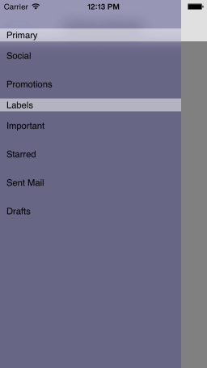

# SideDrawer: Getting Started

This quick start tutorial demonstrates how to create a simple iOS application with <code>TKSideDrawer</code>.




## Setting up TKSideDrawer with TKSideDrawerController

Now that our project is created and the TelerikUI.framework is added, we can start referencing and using the TelerikUI types:

Open your **UIViewController** file and add a reference to the TelerikUI namespace:

```C#
using TelerikUI;
```

Note that starting with Xcode 6 Apple doesn't generate the precompiled headers file automatically. That is why you should add import the UIKit framework before importing TelerikUI:

```C#
using UIKit;
```

Type the following code in your <code>AppDelegate</code> implementation class inside the <code>FinishedLaunching</code> method:

<snippet id='sidedrawer-appdelegate'/>
<snippet id='sidedrawer-appdelegate-swift'/>
```C#
[Register ("AppDelegate")]
public partial class AppDelegate : UIApplicationDelegate
{
    // class-level declarations

    public override UIWindow Window {
        get;
        set;
    }

    public override bool FinishedLaunching (UIApplication application, NSDictionary launchOptions)
    {
        SideDrawerGettingStarted main = new SideDrawerGettingStarted ();
        TKSideDrawerController sideDrawerController = new TKSideDrawerController (main);
        this.Window.RootViewController = sideDrawerController;

        return true;
    }

    //..
}
```

This code creates an instance of <code>TKSideDrawerController</code> and sets it as a root view controller. <code>TKSideDrawerController</code> is a containter controller that has an <code>TKSideDrawer</code> instance embedded inside. The instance is then used by the content controllers of the TKSideDrawerController.

The next step is to add UINavigationBar, and items to our SideDrawer. You can get the <code>TKSideDrawer</code> instance from the <code>TKSideDrawerController</code> using the <code>sideDrawer</code> property. 

Or, instead of using the <code>sideDrawer</code> property, you can call the <code>TKSideDrawer</code> class method <code>findSideDrawerForViewController:</code> (especially useful and necessary for the C# implementation).

Type the following code in the <code>viewDidLoad</code> method of the content controller:

<snippet id='sidedrawer-appdelegate-ctrl'/>
<snippet id='sidedrawer-appdelegate-ctrl-swift'/>
```C#
public class SideDrawerGettingStarted : UIViewController
{
    TKSideDrawer SideDrawer;

    public override void ViewDidLoad ()
    {
        base.ViewDidLoad ();

        this.View.BackgroundColor = UIColor.Gray;

        UINavigationBar navBar = new UINavigationBar (new CGRect (0, 0, this.View.Frame.Size.Width, 64));
        UINavigationItem navItem = new UINavigationItem ("Getting Started");
        UIBarButtonItem showSideDrawerButton = new UIBarButtonItem ("Show", UIBarButtonItemStyle.Plain, this, new Selector ("ShowSideDrawer"));
        navItem.LeftBarButtonItem = showSideDrawerButton;
        navBar.Items = new UINavigationItem[]{ navItem };
        this.View.AddSubview (navBar);

        this.SideDrawer = TKSideDrawer.FindSideDrawer (0, this);
        TKSideDrawerSection sectionPrimary = this.SideDrawer.AddSection ("Primary");
        sectionPrimary.AddItem ("Social");
        sectionPrimary.AddItem ("Promotions");

        TKSideDrawerSection sectionLabels = this.SideDrawer.AddSection ("Labels");
        sectionLabels.AddItem ("Important");
        sectionLabels.AddItem ("Starred");
        sectionLabels.AddItem ("Sent Mail");
        sectionLabels.AddItem ("Drafts");
    }

    [Export ("ShowSideDrawer")]
    public void ShowSideDrawer ()
    {
        this.SideDrawer.Show ();
    }
}
```

## Attaching TKSideDrawer to UIViewController

<code>TKSideDrawer</code> can be attached to your view controllers without <code>TKSideDrawerController</code>. In such a scenario, you should initialize <code>TKSideDrawerView</code> that should be added as subview to your UIViewController's view and use its <code>mainView</code> property to set up the content of the view.

<snippet id='drawer-attached'/>

<snippet id='drawer-attached-swift'/>

```C#
[Register("SideDrawerGettingStarted")]
public class SideDrawerGettingStarted : XamarinExampleViewController
{
    private TKSideDrawerSection primarySection;
    private TKSideDrawerSection labelsSection;
    SideDrawerDelegate sideDrawerDelegate;

    public UINavigationItem NavItem {
        get;
        set;
    }

    public TKSideDrawerView SideDrawerView {
        get;
        set;
    }

    public override void ViewDidLoad ()
    {
        base.ViewDidLoad ();
        
        this.SideDrawerView = new TKSideDrawerView (this.View.Bounds);
        this.SideDrawerView.AutoresizingMask = UIViewAutoresizing.FlexibleHeight | UIViewAutoresizing.FlexibleWidth;
        this.View.AddSubview (this.SideDrawerView);

        UIImageView backgroundView = new UIImageView (this.SideDrawerView.MainView.Bounds);
        backgroundView.AutoresizingMask = UIViewAutoresizing.FlexibleWidth | UIViewAutoresizing.FlexibleHeight;
        backgroundView.Image = UIImage.FromBundle ("sdk-examples-bg.png");
        this.SideDrawerView.MainView.AddSubview (backgroundView);

        UINavigationBar navBar = new UINavigationBar (new CGRect (0, 0, this.SideDrawerView.MainView.Bounds.Width, 44));
        navBar.AutoresizingMask = UIViewAutoresizing.FlexibleWidth;
        this.NavItem = new UINavigationItem ();
        UIBarButtonItem showSideDrawer = new UIBarButtonItem (UIImage.FromBundle ("menu.png"), UIBarButtonItemStyle.Plain, this, new Selector ("ShowSideDrawer"));
        this.NavItem.LeftBarButtonItem = showSideDrawer;
        navBar.Items = new UINavigationItem[] { this.NavItem };
        this.SideDrawerView.MainView.AddSubview (navBar);

        primarySection = new TKSideDrawerSection ("Primary");
        primarySection.AddItem ("Social");
        primarySection.AddItem ("Promotions");

        labelsSection = new TKSideDrawerSection ("Labels");
        labelsSection.AddItem ("Important");
        labelsSection.AddItem ("Starred");
        labelsSection.AddItem ("Sent Mail");
        labelsSection.AddItem ("Drafts");

        this.sideDrawerDelegate = new SideDrawerDelegate ();
        TKSideDrawer sideDrawer = this.SideDrawerView.SideDrawers[0];
        sideDrawer.HeaderView = new SideDrawerHeader (true, this, new Selector ("DismissSideDrawer"));
        sideDrawer.AddSection (primarySection);
        sideDrawer.AddSection (labelsSection);
        sideDrawer.Delegate = this.sideDrawerDelegate;

        sideDrawer.Style.HeaderHeight = 44;
        sideDrawer.Style.ShadowMode = TKSideDrawerShadowMode.Hostview;
        sideDrawer.Style.ShadowOffset = new CGSize (-2f, -0.5f);
        sideDrawer.Style.ShadowRadius = 5;
    }

    public override void ViewWillDisappear (bool animated)
    {
        base.ViewWillDisappear (animated);
        if (this.NavigationController != null) {
            this.NavigationController.InteractivePopGestureRecognizer.Enabled = true;
        }

    }
            
    [Export ("ShowSideDrawer")]
    public void ShowSideDrawer()
    {
        this.SideDrawerView.SideDrawers[0].Show();
    }

    [Export ("DismissSideDrawer")]
    public void DismissSideDrawer()
    {
        this.SideDrawerView.SideDrawers[0].Dismiss();
    }
```
