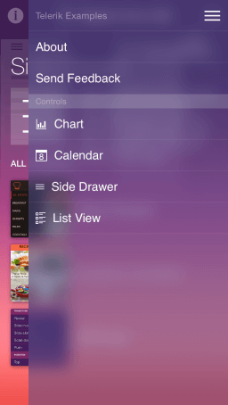

# SideDrawer: Overview

The SideDrawer for iOS steps on the popular navigation pattern where you can access all your application screens from a single sliding menu. Polished effects and transitions are two major advantages of Telerik SideDrawer which are available out-of-the-box. The control is highly customizable and slides in from all four sides of the screen. What also distinguishes the Telerik SideDrawer control is that its items’ content is not limited to navigation options; it can serve arbitrary content. 

**Transition modes**

SideDrawer provides lot’s of transition modes to appeal to every app’s design. The transitions modes are:

- Push
- Reveal
- Reverse Slide Out
- Slide Along
- Slide In On Top
- Scale Up
- Fade In

These transitions can be combined with the SideDrawer’s ability to slide from the one of the four sides of your device, achieving virtually any combination.

**Support for custom content**

Normally, SideDrawer will display a list of your menu items. However, you may want something more unusual for your app. Therefore, you can use the menu surface as a generic container and instead of the standard menu items put a content entirely of your choice.

**Sections**

The SideDrawer supports displaying section headers for a groups of items, thus allowing the end-user to better understand how the app and its navigation are structured.

