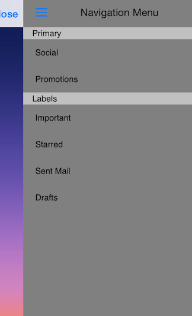

# TKSideDrawer for Xamarin.iOS: Appearance Positions

<code>TKSideDrawer</code> can be shown from all four sides of the screen.



In order to change the postion of <code>TKSideDrawer</code>, you should set its <code>Position</code> property of type `TKSideDrawerPosition`. The available options are: `Left`, `Right`, `Top` and `Bottom`.

> Default position is Left

```C#
sideDrawer.Position = TKSideDrawerPosition.Left;
```

> SideDrawer Positions example can be found in our [Native Xamarin.iOS examples](#native-only-examples).
