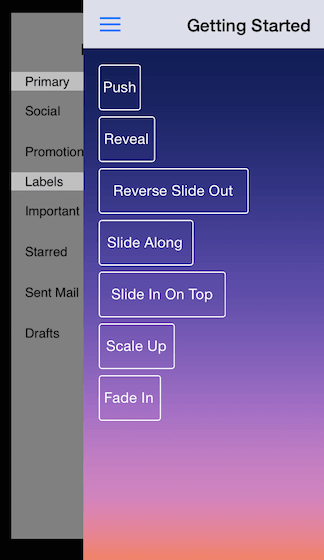
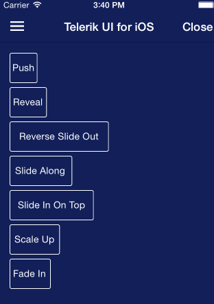
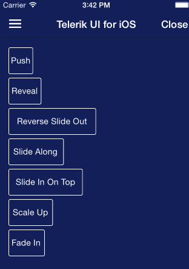
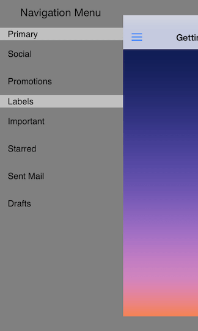

# TKSideDrawer: Transitions

<code>TKSideDrawer</code> transitions let you use different animation effects for showing/dismissing. You can also easily create your custom animation by subclassing the base class <code>TKSideDrawerTransition</code>.



The available transitions are: 

<table>

<tr>
<th>Transition Type</th>
<th>Figures</th>
</tr>

<tr>
<td>Push</td>
<td></td>
</tr>

<tr>
<td>Reveal</td>
<td></td>
</tr>

<tr>
<td>ReverseSlideOut</td>
<td></td>
</tr>

<tr>
<td>SlideAlong</td>
<td></td>
</tr>

<tr>
<td>SlideInOnTop</td>
<td></td>
</tr>

<tr>
<td>ScaleUp</td>
<td></td>
</tr>

<tr>
<td>FadeIn</td>
<td></td>
</tr>

</table>

The default transition is *SlideInOnTop*. In order to change the transition type, you should set the <code>transition</code> property of <code>TKSideDrawer</code>:

<snippet id='drawer-transition'/>

<snippet id='drawer-transition-swift'/>

```C#
sideDrawer.TransitionType = TKSideDrawerTransitionType.Reveal;
```

You can configure the speed of the transition setting the <code>transitionDuration</code> property of <code>TKSideDrawer</code>

<snippet id='drawer-transitions-duration'/>

<snippet id='drawer-transitions-duration-swift'/>

```C#
sideDrawer.TransitionDuration = 0.5f;
```

## Using Custom Transitions

You can create a custom transition by sublcassing <code>TKSideDrawerTransition</code> and overriding its methods. After you create your transtion you should tell the side drawer to use it by setting its <code>transitionManager</code> property.



<snippet id='drawer-transition-manager'/>

<snippet id='drawer-transition-manager-swift'/>

```C#
MyTransition transition = new MyTransition (sideDrawer);
sideDrawer.TransitionManager = transition;
```


