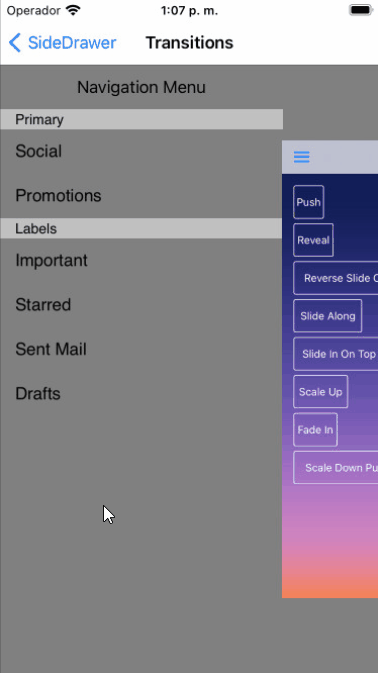

# TKSideDrawer for Xamarin.iOS: Transitions

<code>TKSideDrawer</code> transitions let you use different animation effects for showing/dismissing. You can also easily create your custom animation by subclassing the base class <code>TKSideDrawerTransition</code>.


## Transition Types

<table>

<tr>
<th>Transition Type</th>
<th>Figures</th>
</tr>

<tr>
<td>Push</td>
<td></td>
</tr>

<tr>
<td>Reveal</td>
<td></td>
</tr>

<tr>
<td>ReverseSlideOut</td>
<td></td>
</tr>

<tr>
<td>SlideAlong</td>
<td></td>
</tr>

<tr>
<td>SlideInOnTop</td>
<td></td>
</tr>

<tr>
<td>ScaleUp</td>
<td></td>
</tr>

<tr>
<td>FadeIn</td>
<td></td>
</tr>

<tr>
<td>ScaleDownPusher</td>
<td></td>
</tr>

</table>

The default transition is *SlideInOnTop*. In order to change the transition type, you should set the <code>TransitionType</code> property of <code>TKSideDrawer</code>:

```C#
sideDrawer.TransitionType = TKSideDrawerTransitionType.Reveal;
```

## Transition Duration

You can configure the speed of the transition setting the <code>TransitionDuration</code> property of <code>TKSideDrawer</code>

```C#
sideDrawer.TransitionDuration = 0.5f;
```

> SideDrawer Transitions example can be found in our [Native Xamarin.iOS examples](#native-only-examples).

## Using Custom Transitions

You can create a custom transition by sublcassing <code>TKSideDrawerTransition</code> and overriding its methods. After you create your transtion you should tell the side drawer to use this transition by setting its <code>TransitionManager</code> property.


```C#
MyTransition transition = new MyTransition (sideDrawer);
sideDrawer.TransitionManager = transition;
```

Here is the MyTransition implementation:

```C#
public class MyTransition : TKSideDrawerTransition
{
	private CGPoint sideDrawerIdentityCenter;
	private CGPoint hostviewIdentityCenter;

	public MyTransition(TKSideDrawer sideDrawer) : base(sideDrawer)
	{
	}

	public override void Show ()
	{
		if (!this.SideDrawer.IsVisible) {
			this.SideDrawer.Frame = new CGRect (0, -this.SideDrawer.Superview.Bounds.Size.Height, this.SideDrawer.Width, this.SideDrawer.Superview.Bounds.Size.Height);
			sideDrawerIdentityCenter = this.SideDrawer.Center;
			hostviewIdentityCenter = this.SideDrawer.Hostview.Center;
		}

		this.TransitionBegan (true);
		UIView.Animate (this.SideDrawer.TransitionDuration, delegate {
			this.SideDrawer.Center = new CGPoint(sideDrawerIdentityCenter.X, sideDrawerIdentityCenter.Y + this.SideDrawer.Bounds.Size.Height);
			this.SideDrawer.Hostview.Center = new CGPoint(hostviewIdentityCenter.X + this.SideDrawer.Width, hostviewIdentityCenter.Y);
		}, delegate {
			this.TransitionEnded(true);
		});
	}

	public override void Dismiss ()
	{
		this.TransitionBegan (false);
		UIView.Animate (this.SideDrawer.TransitionDuration, delegate {
			this.SideDrawer.Center = new CGPoint(this.SideDrawer.Width / 2.0, -this.SideDrawer.Frame.Size.Height / 2.0);
			this.SideDrawer.Hostview.Center = new CGPoint(this.SideDrawer.Hostview.Superview.Bounds.Width / 2.0,
				this.SideDrawer.Hostview.Superview.Bounds.Height / 2.0);
		}, delegate {
			this.TransitionEnded(false);
		});
	}

	public override void TransitionBegan (bool showing)
	{
		if (showing) {
			this.SideDrawer.Hidden = false;
			this.SideDrawer.Superview.BringSubviewToFront (this.SideDrawer.Hostview);
			this.SideDrawer.Hostview.UserInteractionEnabled = false;
		}
	}

	public override void TransitionEnded (bool showing)
	{
		if (!showing) {
			this.SideDrawer.Hidden = true;
			this.SideDrawer.Hostview.UserInteractionEnabled = true;
		}
	}
}
```

> SideDrawer Custom Transition example can be found in our [Native Xamarin.iOS examples](#native-only-examples).
