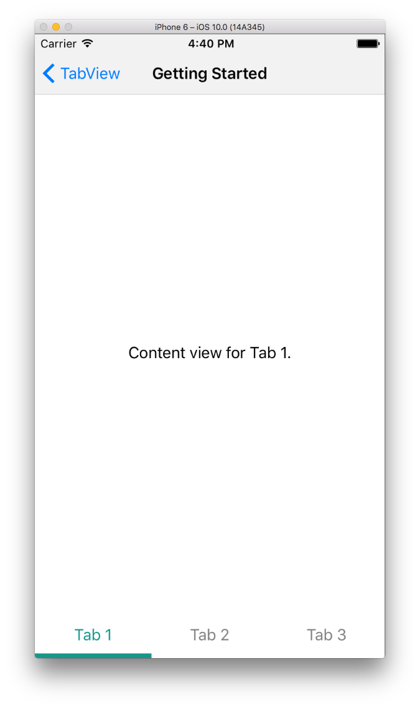

# Getting Started

To use **TKTabView** first an instance needs to be created. The TKTabView class can be used after the TKTabView.h header is imported or <TelerikUI/TelerikUI.h> for the whole
Telerik UI framework.

```Java
RadTabView tabView = new RadTabView(this.getContext());
```

Then we add some tabs:

```Java
tabView.getTabs().add(new Tab("Tab 1"));
tabView.getTabs().add(new Tab("Tab 2"));
tabView.getTabs().add(new Tab("Tab 3"));
```

Povide content views for the tabs:

<snippet id='tabview-delegate-content-view'/>

And we have a fully functioning tab view:


