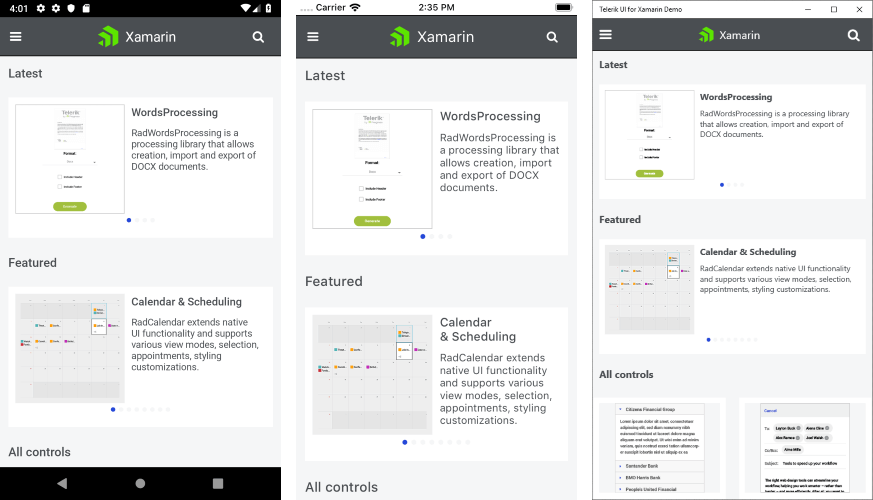
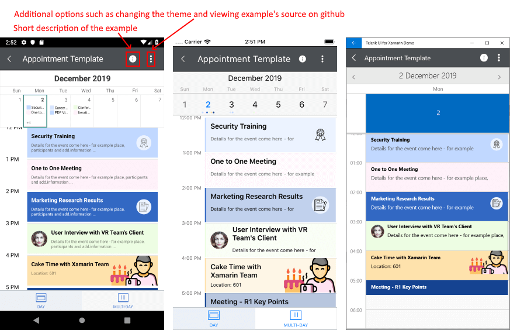
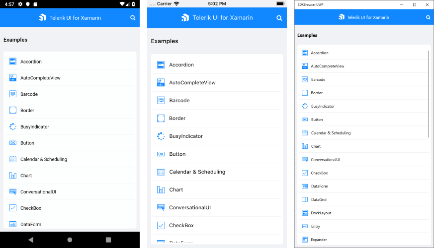
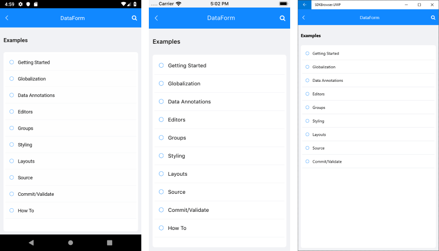

# Demo Applications

**Telerik UI for Xamarin** provides an easy-to-use infrastructure with many fully featured examples demonstrating our Xamarin controls. You can review the source code of each example and get familiar with the configuration possibilities that each provides.

There are two sets of demos showing Telerik Xamarin.Forms controls: **Telerik UI for Xamarin Samples** application and **SDK Browser** application. In this topic you can read what is the purpose of each and how they both are useful.
	
## Telerik UI for Xamarin Samples Application

The "Telerik UI for Xamarin Samples" is the application you can find in the app stores (Google Play, Apple App Store and  Windows Store). It is highly polished and has many scenario-specific use cases designed to show off a subset of features of each component.

The application can be accessed in the following ways:

* It can be found on your computer in the **/[installation-path]/Telerik UI for Xamarin [version]/QSF/** folder;
* You can explore the code directly in the [Samples Application repository on GitHub](https://github.com/telerik/telerik-xamarin-forms-samples/tree/master/_Samples%20Application);
* You can install it from the corresponding app store ([Google Play](https://play.google.com/store/apps/details?id=com.telerik.xamarin&hl=en), [Apple App Store](https://apps.apple.com/dm/app/telerik-ui-for-xamarin-examples/id1083924868) or [Windows Store](https://www.microsoft.com/en-us/p/telerik-ui-for-xamarin-demo/9pld1kn2tcxs)).

The image below shows the Samples application main view with all the Telerik UI for Xamarin controls, there are **Latest** and **Featured** sections to give you quick overview of the features and components recently introduced.

The next images shows a concrete example from the Samples Application (Calendar &amp; Scheduling Appointment Template example):

## SDK Browser Application

The SDKBrowser is a set of various examples that explain how to use the features of a control without the complexity that extra styling and polish can add to an application. It's the go-to source for "how do I use X in Y control". Most of the code snippets available in the documentation are directly generated from that demo (you can see special comments in the code for this).

SDKBrowser application can be accessed in two ways:

* It can be found on your computer in the **/[installation-path]/Telerik UI for Xamarin [version]/Examples/Forms** folder;
* You can directly explore the code in the [SDKBrowser Examples repository on GitHub](https://github.com/telerik/xamarin-forms-sdk/tree/master/XamarinSDK/SDKBrowser/SDKBrowser/Examples). 

	> Repository Note: When cloning a repository, you can restore the Telerik assemblies references in one of three ways:
	>* Copy and paste the **Binaries** folder from the UI for Xamarin installation folder to the **xamarin-forms-sdk/XamarinSDK folder** in your local copy of the repository, 
	>* Update the references directly;
	>* Use the [Telerik NuGet server]() and install the Telerik.UI.for.Xamarin package.

The image below shows the SDKBrowser main view with all the controls listed:

Clicking on any control will navigate to a page containing categories with all the examples related to that component. Every control has a Getting Started category where you can learn how to use it in a basic scenario (in XAML and in code-behind). 

## Native-only Examples

Solutions that show how to use the controls when developing through **Xamarin.Android** or **Xamarion.iOS** are available in the  **/[installation-path]/Telerik UI for Xamarin [version]/Examples/** folder as well. Respectively, they are separated in different folders - iOS and Android. 

Visit the [Native Controls Wrappers]() section for more information on Telerik Xamarin.Android and Xamarin.iOS components.

## See Also

- [System Requirements]()
- [Getting Started on Windows]()
- [Getting Started on Mac]()

