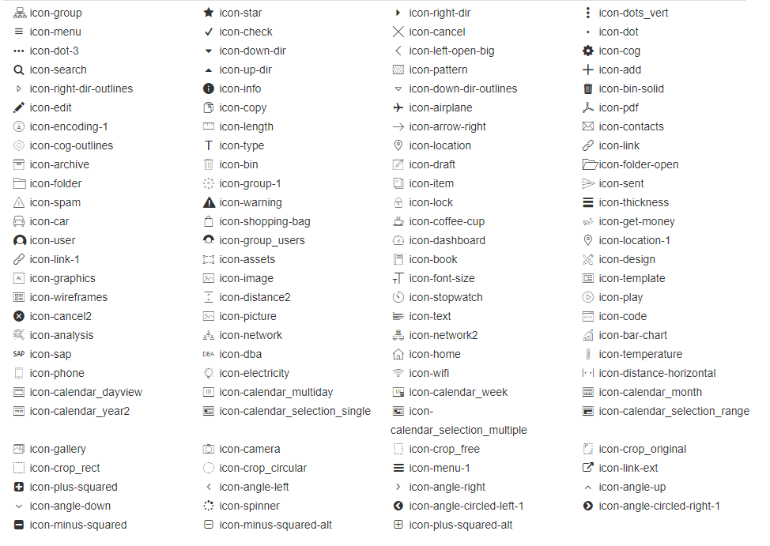
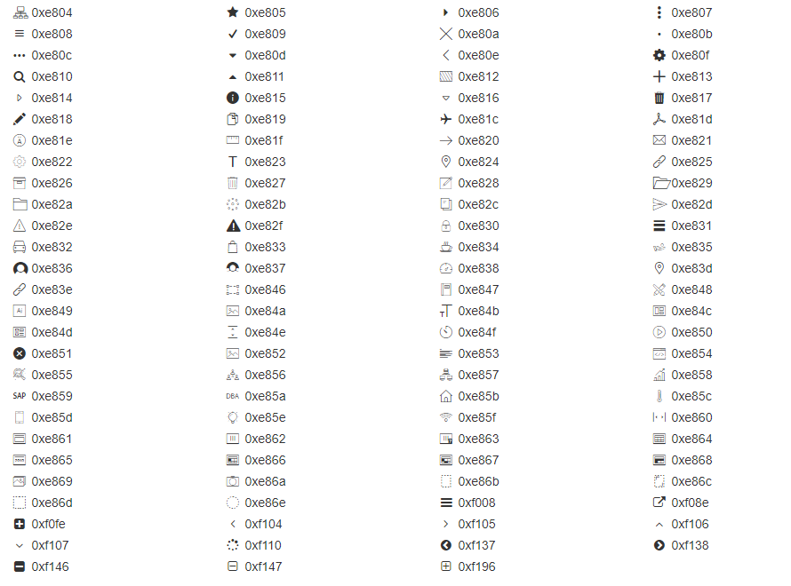

# Telerik UI for Xamarin Font Icons

Telerik font icons is a collection of small vector graphics used across the components from Telerik UI for Xamarin suite. Examples of using font icons include the expand and collapse indicators of Accordion, Expander and TreeView controls, filter and sort indicators of DataGrid control, and other.

This article will give an overview on how you can utilize the Telerik font icons in your app. 

* Include the required Telerik Font file
* Add the font file path
* Choose between the available Telerik icons


## Include the required Telerik Font file

The Telerik Font Icons are located in the telerikfontexamples.ttf file. There are two options you could use to get the **.ttf** file.

* Download the **telerikfontexamples.ttf** file from [here](https://github.com/telerik/telerik-xamarin-forms-samples/blob/master/_Samples%20Application/QSF.Android/Assets/Fonts/telerikfontexamples.ttf).

* Get the font file from the installation folder of Telerik UI for Xamarin: The default location of the **telerikfontexamples.ttf** file is *C:\Program Files (x86)\Progress\Telerik UI for Xamarin [version]\QSF\QSF.Android\Assets\Fonts*

Include Telerik Font **.ttf** file into your application in the following locations:

* Android project: Create **Fonts** folder inside the Android **Assets** and add the **.ttf** file there. 

* iOS project: Create **Fonts** folder inside the iOS **Resources** and add the **.ttf** file there.

You'd also need to modify the info.plist file inside the iOS project with adding the following code:

```xml
<key>UIAppFonts</key>
  <array>
    <string>Fonts/telerikfontexamples.ttf</string>
  </array>
```

* UWP project: Create **Fonts** folder inside the UWP **Assets** and add the **.ttf** file there.


## Add the font file path

As a final step you need to add the path to the Fonts inside the Resources of the App.xaml file of the Xamarin.Forms project:

```XAML
<Application.Resources>
        <ResourceDictionary>
            <x:String x:Key="icon's name">icon's code;</x:String>

            <OnPlatform x:TypeArguments="x:String" x:Key="IconsFont">
                <On Platform="iOS">telerikfontexamples</On>
                <On Platform="Android">Fonts/telerikfontexamples.ttf#telerikfontexamples</On>
                <On Platform="UWP">/Assets/Fonts/telerikfontexamples.ttf#telerikfontexamples</On>
            </OnPlatform>
        </ResourceDictionary>
</Application.Resources>
```

## Choose between the available Telerik icons

You can choose any of the available Telerik Font icons: 



>important You need to set the Telerik Font icon code on the concrete property to visualize the icon. 

The icon's code is:



## Example

If you want to change the default icon of the RadDataGrid OptionsButton with one of the following icons above, set the icon code to the OptionsButtonText property:

The gear icon's code is: **0xe80f** and the final code result that should be set to the OptionsButtonText property is **&amp;#xE80F;**

You have to 
* replace the **0x** with **&#x** 
* capitalize all the letters
* put a semicolon at the end of the string

```XAML
<telerikGrid:DataGridTextColumn.HeaderStyle>
    <telerikGrid:DataGridColumnHeaderStyle OptionsButtonText="&#xE80F;"/>
</telerikGrid:DataGridTextColumn.HeaderStyle>
```

## See Also

* [How To Set a Theme]()
* [Themes Overview]()
