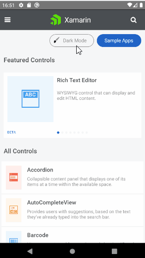

# Overview

Android 10 (API level 29) and iOS 13 introduce system-wide dark appearance for all user interface elements, known as [Dark theme](https://developer.android.com/guide/topics/ui/look-and-feel/darktheme) for Android and [Dark Mode](https://developer.apple.com/documentation/xcode/supporting_dark_mode_in_your_interface) for iOS. They have many benefits as to allow users to toggle their interface and focus on the application’s content based on ambient lighting conditions as well as to reduce power usage amount depending on the device's screen technology.

>note From the R1 2021 Official Release the Telerik UI for Xamarin controls have a support for Dark Theme/Dark Mode on Android and on iOS.

## Dark Theme for Android

In order to support Dark theme for Android, the application's theme must inherit from a DayNight theme as explained [here](https://developer.android.com/guide/topics/ui/look-and-feel/darktheme#supporting_dark_theme_in_your_app).

Example:

Set the app theme inside the Resources/values/styles.xml file located in the Android project.

```xml
<style name="MainTheme" parent="Theme.AppCompat.DayNight">
```

Here is how some of the Telerik Xamarin controls look on Android with Darh Theme applied

ListView, DataForm and DataGrid:


> Make sure to test your application carefully and thoroughly on both Light and Dark system appearance.

## Dark Mode for iOS

Telerik UI for Xamarin controls **automatically** react to system appearance changes.

Here is how some of the Telerik Xamarin controls look on iOS with Darh Mode applied:

DateTime Picker, Calendar and Chart controls:


> Make sure to test your application carefully and thoroughly on both Light and Dark system appearance.

## App Theme Binding

If you want to make your Xamarin.Forms applications to respond to system theme changes, you need to consume resources with the AppThemeBinding markup extension, and the SetAppThemeColor and SetOnAppTheme<T> extension methods.

Requrements: 

* Xamarin.Forms 4.6.0.967 or greater.
* iOS 13 or greater.
* Android 10 (API 29) or greater.

> For more details about this please review the following article from the Microsoft documentation: [Respond to system theme changes in Xamarin.Forms applications](https://docs.microsoft.com/en-us/xamarin/xamarin-forms/user-interface/theming/system-theme-changes).

* **Detecting the current system theme**: This can be achieved by getting the value of the `Application.RequestedTheme` property. Information about this option can be found [here](https://docs.microsoft.com/en-us/xamarin/xamarin-forms/user-interface/theming/system-theme-changes#detect-the-current-system-theme).

* **Set the app theme**

	If you want to specify the theme which your Xamarin.Forms application will use, regardless of which system theme is currently operational, set the `Application.UserAppTheme` property (*of type Xamarin.Forms OSAppTheme*):
	
	```C#
	Application.Current.UserAppTheme = OSAppTheme.Dark;
	```
	
	For more details on this check [here](https://docs.microsoft.com/en-us/xamarin/xamarin-forms/user-interface/theming/system-theme-changes#set-the-current-user-theme).

* **Theme Changes**

If you want your Xamarin.Forms app to be notified when the system theme changes you have to use the `Application.RequestedThemeChanged` even. For more information on this check [here](https://docs.microsoft.com/en-us/xamarin/xamarin-forms/user-interface/theming/system-theme-changes#react-to-theme-changes).

### Example

The [Telerik UI for Xamarin Samples Application]() has a dark mode support on Android and on iOS. You can change the app theme by clicking on a button. 



## See Also

* [Telerik Font Icons]()
* [Telerik Blue Theme]()
